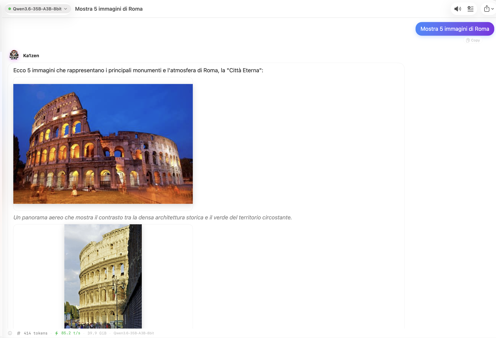

# Changelog

All notable changes to Ka1zen are documented here.
The format follows [Keep a Changelog](https://keepachangelog.com/en/1.1.0/), and the project adheres to [Semantic Versioning](https://semver.org/spec/v2.0.0.html).

## [0.3.41] — 2026-05-18

Ships two independent improvements: an **auto-updater** (with one-click DMG install + relaunch, no more manual GitHub-and-drag-to-Applications routine for every release) and an **MTP (Multi-Token Prediction) badge** for checkpoints shipping self-speculative draft heads. The MTP badge is honest about reality: mlx-lm 0.31.3 detects MTP weights and silently drops them at load (`qwen3_5.py:313`), so the speedup published on model cards isn't exploited yet — the badge surfaces the latent capability without lying about runtime behaviour.

### Added

- **Auto-update — Phase A (periodic check + non-modal banner).** `Core/System/AutoUpdater.swift` polls `api.github.com/repos/Flor1an-B/Ka1zen/releases/latest` at startup (debounced 30 s so the boot path isn't slowed) and every 24 h while the app runs. When a newer tag is found, `Features/Settings/UpdateBannerView.swift` slides a banner into the top of `ContentView` offering **Install Now / Later / Skip This Version**. *Skip* is per-version: a single skip silences the banner until a newer release supersedes the skipped one, so users don't accidentally lock themselves out of future updates.
- **Auto-update — Phase B (one-click install + relaunch).** Clicking *Install Now* downloads the DMG via the existing `UpdateDownloader`, writes a small shell script to `/tmp/ka1zen-installer-<uuid>.sh`, launches it as a **detached subprocess** via `/usr/bin/nohup`, and quits the app. The script: waits up to 30 s for the old PID to exit (with `kill -9` as a hard timeout), unmounts any stale `/Volumes/Ka1zen*` from interrupted previous installs, `hdiutil attach`es the new DMG, swaps `/Applications/Ka1zen.app` with `rm -rf` + `cp -R`, clears quarantine with `xattr -cr`, `hdiutil detach`es, and `open`s the freshly-installed bundle. Self-cleans the script. Full audit log written to `/tmp/ka1zen-installer.log` for post-mortem debugging.
- **`Settings → Updates` reactive section.** New `UpdateSettingsRow` view in `Features/Settings/UpdateBannerView.swift` that observes `@ObservedObject AutoUpdater.shared` and renders **five distinct status indicators** depending on state — *No check yet*, *Contacting GitHub Releases…* (spinner), *You're on the latest version (v X.Y.Z) · checked N min ago* (green), *Update available: v X.Y.Z* (accent), or *Check failed — \<error\>* (orange). Replaces the previous inline section that read `AutoUpdater.shared.isChecking` as a plain value — without `@ObservedObject`, the *Check Now* button fired but produced no visible feedback when the install was already up-to-date.
- **MTP detection + badge in `Model Manager → Installed`.** New `hasMTP` + `mtpLayers` fields on `ModelArchitectureDetails`, detected by scanning `model.safetensors.index.json` for `mtp.*` weight keys (DeepSeek-V3 / Qwen3.6-MTP convention) with a fallback to `config.json` markers (`num_nextn_predict_layers`, `num_mtp_modules`, `mtp_layers`, also under `text_config` for VLMs). UI surfaces a small indigo *MTP* badge next to the capability pills (Vision / Tools / Thinking / Audio) — tooltip is honest about mlx-lm not yet exploiting the speedup so users don't expect the 1.5–2× advertised on model cards.

### Internal

- New `Core/System/AutoUpdater.swift` — singleton `@MainActor` `ObservableObject`. UserDefaults-backed: `autoUpdateCheckEnabled` (Bool, default true, master kill switch), `autoUpdateLastCheck` (Date, throttle gate), `autoUpdateSkippedVersion` (String, per-version skip). 24 h scheduled `Timer` with 60 s tolerance so macOS can coalesce wake-ups. `start()` / `stop()` API for the toggle.
- `AutoUpdater.installAvailable()` orchestrates the four-stage `InstallState` machine (`idle → downloading → preparingInstall → relaunching`, or `failed(reason)`). Each transition updates published state for the banner UI; `downloadFraction` is published from a `Task` that polls `UpdateDownloader.fractionCompleted` every 100 ms during the download.
- `AutoUpdater.kickOffInstaller()` writes the installer shell script to `/tmp` with `chmod 0755`, then launches it via `Process(executableURL: /usr/bin/nohup)` with stdout/stderr piped to `/dev/null` so the child survives the parent's `NSApp.terminate(nil)`.
- `AutoUpdater.installerScript()` returns the bash script as a String constant — embedded in source rather than shipped as a resource so future changes don't need a separate file update + remediation path. Parameters (oldPID, dmgPath, targetAppPath) are heredoc-substituted; no user input flows in, so shell escaping is bounded to controlled local paths.
- New `HuggingFaceClient.detectMTPFromSafetensorsIndex(modelID:)` — best-effort scan of `model.safetensors.index.json#weight_map` for keys starting with `mtp.` or containing `.mtp.` (handles both flat and nested checkpoint layouts). Short-circuits on first hit. Silently returns `false` for single-shard models without an index — those rarely carry MTP heads anyway since MTP-equipped checkpoints typically exceed the single-file shard size.
- `ContentView` body now wraps `NavigationSplitView` inside a top-level `VStack` so `UpdateBannerView` can stack above without overlapping the split view. `.task { AutoUpdater.shared.start() }` modifier kicks off the service exactly once per app launch.

## [0.3.40] — 2026-05-13

Brings **Server Console** — a per-model live view of the underlying `mlx_lm.server` / `mlx_vlm.server` subprocess. Each running model now exposes a terminal icon in `Model Manager → Installed` that opens a sheet streaming stdout + stderr in real time, headed by the full launch metadata (modelID, PID, port, executable, arguments, environment variables) and ending with Copy / Save buttons for bug reports. Ships together with a **fatal-error scanner** that watches the live stderr for the narrow set of patterns that mean "the process is up but its inference path is dead" (the canonical `mlx_lm.server` failure mode for unsupported architectures like `bailing_hybrid` / `deepseek_v4`): the moment a fatal pattern fires, the server is automatically killed, the model's row flips to a new **STUCK** state badge, the Console sheet opens itself, and the user lands directly on the actual Python error instead of an indefinite "loaded but silent" state.

### Added

- **Server Console sheet** (`Features/ModelManager/ServerConsoleView.swift`). Per-model, per-launch live mirror of the server subprocess:
  - **Header** — modelID, status badge (LIVE / STUCK / CRASHED / EXITED), PID, port, started timestamp, executable path, full argument list, environment variables.
  - **Output stream** — stdout (primary text), stderr (orange), and `[sys]` system messages (accent colour) interleaved by timestamp. Soft-capped at 256 KB; older lines auto-trimmed with a `[N older line(s) trimmed]` marker so chatty `tqdm` progress bars can't run away with memory.
  - **Footer actions** — `Auto-scroll` toggle (defaults on, follows tail), `Copy` button (header + log to clipboard as plain text), `Save…` button (writes `ka1zen-server-<modelID>-<timestamp>.txt`), `Close`.
- **Terminal icon in `InstalledModelCard`** — appears alongside Launch / Stop whenever a model has a console available for this session (live, crashed, exited, or stuck). One-click into the sheet.
- **Auto-open on crash and stuck** — when `ModelLauncher` detects a real process termination *or* a fatal stderr signature, it broadcasts a notification that `ModelManagerView` consumes to auto-present the Server Console sheet for the affected model. The user no longer has to wonder "loaded but silent — what's wrong?": the actual exception lands in front of them.
- **Fatal-error scanner** (`FatalErrorScanner.detect(in:)` in `Core/LLM/ServerConsole.swift`). Whitelist-only inline matcher that flags the three signatures empirically observed to mean "service is dead even though process is alive":
  - `Exception in thread Thread-1 (_generate)` → *"Generator thread crashed — server is up but cannot answer"*
  - `ValueError: Model type X not supported` → *"Model type X not supported"* (regex captures the architecture name)
  - `ModuleNotFoundError: No module named 'mlx_lm.models.X'` → *"Model type X not supported by mlx-lm"*
  Every other stderr content stays informational (warnings, retried tracebacks, …) and does NOT trip the badge — false positives would erode trust in the signal faster than they'd add value.
- **`ServerState.stuck(reason: String)`** — new enum case distinguishing "process up but inference dead" from `.failed` (process actually exited). Treated like `.failed` for UI purposes (badge red, console auto-opens), but ModelLauncher knows the process still needs killing.

### Changed

- **`StderrCapture` → `ServerConsole`** transition for the launch path. The 64 KB rolling stderr buffer is preserved (still used by `extractError()` for `lastStderr(for:)`), but the launcher now ALSO routes every stdout / stderr chunk into the observable `ServerConsole`. **Stdout was historically ignored** — the existing `process.standardOutput = Pipe()` had no readability handler. mlx-lm's port-bind notes and tqdm progress bars only show on stdout, so capturing it is the difference between "user sees what's happening" and "silent stuck server".
- **Inline stderr scan during launch** (`ModelLauncher.swift`, stderr readabilityHandler). Single-shot per launch via an `AtomicBool` flag — once a fatal pattern fires, subsequent chunks of the same traceback are silenced. Detection triggers `markStuck(modelID:reason:)` which transitions state, broadcasts `modelLauncherDidGetStuck`, and schedules a `stop(modelID:)` call ~100 ms out so the now-useless Python process doesn't keep burning RAM / holding the port.
- **State badge and action buttons treat `.stuck` like `.failed`** in `ModelManagerView`, `ModelPickerView`, and `DiagnosticsService`. Red badge, terminal icon visible, primary action returns to "Launch" once the auto-kill completes.

### Internal

- New `Core/LLM/ServerConsole.swift` — `@MainActor` observable model + `Notification.Name.modelLauncherDidCrash` + `Notification.Name.modelLauncherDidGetStuck` declarations + `FatalErrorScanner` whitelist matcher. `nonisolated init` so `ModelLauncher.launch(...)` can construct it from its non-MainActor context; all subsequent mutation hops to MainActor via `Task { @MainActor in ... }`.
- New `Features/ModelManager/ServerConsoleView.swift` — pure SwiftUI sheet; auto-scroll managed by a `ScrollViewReader` keyed off `console.lines.count`; per-source colour mapping (stdout primary, stderr orange, system accent); `NSPasteboard.general` copy + `NSSavePanel` for save.
- `ModelLauncher.swift` — internal `AtomicBool` helper (NSLock-protected boolean) used by the readability handler's stuck-once flag; new `consoles: [String: ServerConsole]` dictionary indexed by modelID; new public accessor `console(for: String) -> ServerConsole?`; `terminationHandler` now drains both pipes (stdout was previously not drained), marks the console terminated, and posts `modelLauncherDidCrash` on non-zero non-signal exit.
- `ModelManagerView` listens on both `modelLauncherDidCrash` and `modelLauncherDidGetStuck` and binds the sheet to a `@State var consoleForModel: ServerConsole?` (Identifiable via modelID, so SwiftUI cleanly re-presents when a different model crashes while one is already open).
- xcodegen regenerated to pick up the new sources (Ka1zen.xcodeproj is gitignored, project.yml is the source of truth).

## [0.3.39] — 2026-05-13

Reasoning models that ship a sidecar `chat_template.jinja` (NVIDIA Nemotron-3-Nano, Qwen3-Next…) were systematically miscategorised as non-thinking by `Auto-detect`, so Ka1zen sent `enable_thinking=false` to `mlx_lm.server`. The template then injected an empty `<think></think>` block before generation, putting the model out-of-distribution and triggering hard **mode-collapse loops** on long-form prompts ("par parution par parution…", "35 minutes avant la publication…", `[22] [23] [24]…[167]` numerical drift). Three coordinated fixes ship together: stronger thinking detection (template-based + sidecar-parser-based + extended name patterns), an auto-applied **reasoning stability bundle** (`repetition_penalty=1.05`, `min_p=0.02`) that kills the residual repetition pathways once the thinking flag is right, and a one-shot retro-migration so users who already installed reasoning models before this build get the same protection without touching `Settings → Models`. **Zero per-model hardcoding** — every signal is generic and applies to any future thinking model published with the same conventions.

### Fixed

- **Mode-collapse loops on reasoning models** (`NVIDIA-Nemotron-3-Nano-30B-A3B-MLX-*`, and any model that ships `<think>` in its chat template). Root cause was a chain of cascading defaults: `Auto-detect` returned `supportsThinking=false`, `LLMClient` forwarded `enable_thinking=false` in `chat_template_kwargs`, the publisher template responded by emitting `<|im_start|>assistant\n<think></think>` (an empty pre-closed reasoning block, never seen during training), and the model collapsed onto repeating tokens/phrases as soon as the prompt was non-trivial. Fix is dynamic: any model whose template carries `<think>` / `<reasoning>` or that ships a `*reasoning_parser*.py` sidecar is now flagged as a thinking model at install time and at startup migration time, so `enable_thinking=true` flows through.

- **Residual numerical / phrase repetition** even on reasoning models that were correctly flagged (the `[22] [23] [24]…[167]` drift the user saw under "Ouest-France"). Cured by auto-applying a stability bundle when `supportsThinking=true` and the publisher's `generation_config.json` is silent on these fields: `repetition_penalty=1.05` (kills any re-emitted token), `min_p=0.02` (drops the low-probability tail that compounds into runaway sequences). Publisher values always win — the bundle only fills holes.

### Added

- **Three new generic signals in `HuggingFaceClient.localCapabilities`** that detect thinking models without any per-model hardcoding:
  - Template signal — `chat_template.jinja` sidecar file OR `tokenizer_config.json#chat_template` contains `<think>` or `<reasoning>`.
  - Sidecar parser signal — snapshot directory contains a file matching `*reasoning_parser*` (NVIDIA's convention for new reasoning families).
  - Extended name heuristics — `reasoning`, `nano-2`, `nano-3`, `-cot` added alongside the existing `qwen3 / deepseek-r1 / thinking / gemma3+ / mistral-{small-4,medium-4,large}` patterns.
- **`readChatTemplate(at:)` helper in `HuggingFaceClient`** — reads `chat_template.jinja` first (newer convention) and falls back to inline `tokenizer_config.json["chat_template"]`. Used by the new thinking detection.
- **Reasoning stability bundle in `ModelInstaller.registerConfig`** — when `supportsThinking` resolves to true and the publisher is silent on `repetition_penalty` / `min_p`, those fields are set to `1.05` and `0.02` respectively. Publisher's own values always take precedence.
- **`SettingsView.resetToPublisherDefaults` now applies the stability bundle too** — clicking "Reset to publisher defaults" on a reasoning model whose publisher omits these fields gets the safe defaults rather than walking the user back into mode-collapse territory.
- **One-shot `migrateReasoningStability` in `PersistenceController`** — retro-fits the stability bundle onto every locally-served thinking config that currently has `repetition_penalty=0` and `min_p=0`. Scope-limited to local endpoints (`127.0.0.1` / `localhost`), idempotent via `migrateReasoningStability_v1_done` UserDefaults flag. Runs after `migrateCapabilities` so any freshly-promoted thinking config is visible to the pass.

### Changed

- **`migrateCapabilities` now prefers `capabilitiesFromCache` over name heuristics** — reads `config.json` and the chat template itself rather than guessing from the modelID string. This is what catches Nemotron-3-Nano's thinking flag (its name has no `qwen3` / `r1` / `thinking` marker, but its template carries `<think>`).
- **`migrateCapabilities` now applies the stability bundle on a `thinking false→true` transition** — only when the values are at 0 (the "never been set" state), only for local endpoints, never overwriting an intentional non-zero user choice.

### Internal

- Thinking detection in `HuggingFaceClient.localCapabilities` now layers four signals in priority order: chat-template content > sidecar reasoning_parser > model_type / architecture prefixes > name patterns. The first two are cache-only and survive renaming / re-quanting; the last two are the offline fallback when the cache isn't populated yet (e.g. browsing HF before download).
- `ModelConfig.minP` is now explicitly set in the `ModelInstaller.registerConfig` constructor call (was defaulting to 0). The cascade respects publisher silence: if the publisher doesn't specify a generation param, the family fallback gets its chance; if the family fallback is silent too, the reasoning bundle's value applies; only then 0.
- Migration ordering in `PersistenceController.load()` documented inline — `migrateLocalhostToLoopback` → `migrateCapabilities` → `migrateMaxTokens` → `migrateReasoningStability` → `cleanGhostFoldersAndConfigs` → `syncWithInstalledModels` → `migrateMultiVariantOrphans`. Each step's preconditions and dependencies on the previous steps are captured in the surrounding comments so the ordering can't drift accidentally.

## [0.3.38] — 2026-05-13

Two startup hygiene migrations land together to fix the long-standing **phantom "Not installed" badge** on `Settings → Models`. Stale **ghost cache folders** (HuggingFace download stubs that died after the metadata fetch but before any blob landed — canonical signature is `refs/` present, `blobs/` empty) are now scanned and removed at app launch alongside their matching `ModelConfig`. A second migration catches legacy **bare configs of multi-variant repos** (e.g. `fcreait/Qwen-Image-Edit-mflux`) when the modern flow has already registered a composite config (`…/q8`) — the bare entry was a pure duplicate that produced a permanent orange badge. Both passes are idempotent and become no-ops after the first launch. The **User Guide** now documents the **BYOB** (Bring Your Own Backend) pattern: plug any OpenAI-compatible server (vLLM, Ollama, `llama-server`, LM Studio, MLC LLM, …) into Ka1zen's chat picker for bleeding-edge architectures that `mlx-lm` doesn't support yet (DeepSeek V4, MTP, exotic MoE).

### Fixed

- **Permanent "Not installed" badge on Settings → Models.** Two distinct migrations now run during `PersistenceController.load()`:
  - **Ghost folder cleanup.** Enumerates `~/.cache/huggingface/hub/models--*` entries with no `blobs/` payload (the canonical "ghost folder" signature). A folder with `blobs/` present — even with `.incomplete` files inside — is intentionally left alone so an in-flight download from another tool can resume without Ka1zen wiping it mid-flight. For each ghost the cache folder is removed and the matching `ModelConfig` is dropped, its `SecretStore` entry purged, and any `ModelRole` that pointed at the now-defunct ID is reset to its default. Runs **before** `syncWithInstalledModels` so sync never re-imports a stale shell.
  - **Multi-variant orphan migration.** Detects bare-form `ModelConfig` entries whose `modelID` is the bare repo of a known multi-variant family (`MultiVariantRepoRegistry.variants(for:) != nil`) AND at least one variant of that repo is installed. Two branches: if a composite config (`fcreait/Qwen-Image-Edit-mflux/q8`) already exists → drop the bare entry as a duplicate, reassigning any dangling system role to the composite first; if no composite exists yet → rewrite the bare's `modelID` to the first installed variant, preserving user-customised generation params (temperature, context length, capability flags). Runs **after** `syncWithInstalledModels` so every installed variant is guaranteed to already have its own composite config in place before we deduplicate.

### Added

- **BYOB (Bring Your Own Backend) section in `USER_GUIDE.md`.** New subsection under `11. Settings → Models tab — endpoints` documenting how to plug vLLM / Ollama / `llama-server` / LM Studio / MLC LLM into Ka1zen. Useful when a bleeding-edge architecture lands on a third-party server before mlx-lm upstreams it. Includes per-backend launch commands, the three "Add Model" fields, and a caveats block on per-backend capability quirks (tool calling support, generation parameter coverage, lifecycle ownership, token counting).

### Internal

- New `HuggingFaceClient.isGhostFolder(at:)` — conservative signature returns true iff `blobs/` is missing or empty, deliberately excluding `.incomplete`-containing folders so a partial download from another tool can resume cleanly.
- New `HuggingFaceClient.cleanGhostCacheFolders()` — scans the HF cache root, applies `isGhostFolder`, removes matching entries, and returns the list of removed modelIDs for the persistence layer. Best-effort: individual delete failures are swallowed silently so one broken entry can't block the rest of the cleanup.
- New `PersistenceController.cleanGhostFoldersAndConfigs()` — wires the HF-side cleanup into the config layer: drops matching `ModelConfig`s, purges their `SecretStore` entries (`ModelConfig.secretAccount(for:)`), resets any `ModelRole` whose assigned modelID was just cleared. Logged via `os.Logger(subsystem: "com.ka1zen", category: "Persistence")` for diagnostics.
- New `PersistenceController.migrateMultiVariantOrphans()` — placed after `migrateMaxTokens`. Walks every config, filters on `modelID.contains("/") && MultiVariantRepoRegistry.variants(for:) != nil`, computes installed-variants-of-this-repo from `installedModels`, and either drops or rewrites depending on whether a composite config already exists for any installed variant.
- `PersistenceController.load()` ordering — `cleanGhostFoldersAndConfigs` → `syncWithInstalledModels` → `migrateMultiVariantOrphans`. Ghost cleanup must precede sync so sync sees the freshly cleaned state; orphan migration must follow sync so every installed variant has its own config in place before deduplication.
- `PersistenceController` now imports `os` and uses a module-scoped `Logger` for migration audit trails — first logger in the persistence layer.

## [0.3.37] — 2026-05-12

Three usability features ship together, all aimed at the discovery and quality of the image / model experience. **`BEST FIT` badge** ranks the right quantization for your Mac out of a model family's many variants. **Image preview window** opens a full-size detached viewer on a tap, with zoom and quick actions. **Edit-prompt optimization** rewrites your image edit instruction to the form that diffusion edit models actually follow — translated to English, negatives flipped to positive constraints, identity-preservation cues injected — so face / pose / composition drift on Qwen-Image-Edit and FLUX.2-Klein-Edit drop noticeably.

### Added

- **`BEST FIT` badge in `Model Manager → Browse`.** Search results are silently grouped by family base name (every variant that shares a name modulo its quantization suffix — e.g. `Kimi-K2-Instruct-3bit / -4bit / -6bit / -8bit` collapse into one family), then each group's largest variant whose estimated size still fits the host RAM gets a small green pill next to its existing `Fits well` / `Tight` chip. Logic prefers `fit == .fits` (comfortable headroom) over `.tight` (would fit but no margin); ties broken by largest size since higher quants generally win on quality. Singleton families don't get a badge — the regular fit chip is enough and a "best of one" highlight would be noise. The badge tooltip explains the heuristic so power users can verify the choice.

- **Image preview window.** A click on any generated/edited image in the chat opens a detached, non-modal native macOS window with the image at its natural resolution (capped to 80% of the visible screen at first open). Toolbar carries zoom out/in/fit, a percentage readout, **Copy**, **Save…**, **Reveal in Finder**, and **Close** (`⌘W`). Inside the viewer: pinch-to-zoom (`MagnifyGesture`), drag to pan when zoomed in, double-click to toggle between 100% and 200%. Multiple windows can be open in parallel — useful when comparing variations side-by-side. The window title surfaces the model + duration the bubble badge already shows. Right-click on any image still offers "Open Preview…" as an alternative discovery path.

- **Edit-prompt optimization (default ON).** Before each pinned-image or attach-edit run, Ka1zen routes the user's instruction through the optimizer model with a system prompt purpose-built for diffusion edit pipelines. Three transforms run together: (1) **translate to English** because Qwen-Image-Edit and FLUX.2-Klein-Edit were trained mostly on English instruction pairs and follow them noticeably more reliably; (2) **flip negatives to positive constraints** — `"don't modify the woman"` becomes `"keep the woman's face, body, pose, hairstyle, and proportions exactly identical"`, since diffusion models follow "produce X" much more strongly than "don't produce Y"; (3) **add identity-preservation cues** — face, body, pose, hair, clothing, background, lighting, camera angle. The rewritten instruction is what reaches mflux and what appears under the result image as `Edit instruction: "…"` so the user can audit it. Adds ~1-3 s per edit (a single call to the optimizer model, usually already warm). Toggle in `Settings → General → Image Generation → Optimize edit prompts`.

### Changed

- **Visible progress for prompt-optimization phases.** Transient assistant-bubble statuses now carry an icon + bold formatting so they survive the eye even when the optimizer model is fast (Gemma-4-E4B finishes in ~2.5 s on M-series). `Optimizing edit prompt…` becomes `✨ **Optimizing edit prompt…**`, `Editing image… Steps: X/Y` becomes `🎨 **Editing image…** Steps: X/Y`, same treatment for the generation paths. The input-bar `isOptimizingPrompt` banner (ProgressView + spinner) also raises during image-edit optim, giving the user a second visual cue independent of the chat scroll position.

### Internal

- New `ModelManagerViewModel.familyBaseName(_:)` — strips trailing quantization suffix tokens (`-4bit` / `-mxfp8` / `-bf16` / `-fp16` / `-fp8` / `-DWQ` / `-DQ` / `-OptiQ` / `-mlx`) from a HF model id to produce the grouping key. Handles chained suffixes like `-mlx-3bit` and `-2bit-DQ` by repeating the match block in the regex. Case-insensitive, idempotent on ids without a recognised tail.

- New `ModelManagerViewModel.bestFitModelIDs` — `Set<String>` of modelIDs flagged as best-fit for the current `searchResults`. Computes once per render by zipping each result with its `ModelSizeResolver` size (falls back to `ModelCompatibility.size` name-parse when the API resolver hasn't fired yet) and the host's `HardwareInfo.current`. Browse passes the set into `BrowseModelCard` as an `isBestFit: Bool` flag — the card already had `sizeGB` + `fit` plumbing in place from the existing fit chip, so the new pill is just one more conditional view in the same row.

- `BrowseModelCard` gains an `isBestFit` parameter (defaults to `false` for backward compat) and a `bestFitBadge` view alongside the existing `fitChip`. Tooltip on hover. No layout reflow — the badge slots into the existing meta line.

- New `Features/ImagePreview/ImagePreviewWindow.swift` — `NSWindowController` subclass mirroring `HTMLPreviewWindowController` (static `liveControllers` retention, single `present(path:modelName:duration:)` entry point, releases via `NSWindowDelegate.windowWillClose`). Content is a pure SwiftUI `ImagePreviewContent` hosted via `NSHostingView`: GeometryReader-anchored `Image(nsImage:).resizable().scaledToFit()` with `MagnifyGesture` + `DragGesture` for zoom/pan, double-tap to toggle 1×/2×, toolbar with Copy / Save…/ Reveal / zoom controls / Close (⌘W). Reads the image at click time so a progressive write (mflux's per-step PNG) lands cleanly if the user races to click.

- New `ChatViewModel.optimizeImageEditPrompt(_:config:)` and `ChatViewModel.imageEditOptimizationEnabled` static getter. The optimizer prompt is intentionally short (~250 words system, single-line user input, output capped to ~60 words) — long rewrites dilute the change signal across too many tokens and the edit model splits attention. Examples baked into the system prompt anchor the model on the right output shape.

- `InlineGeneratedImage` tap gesture wired to `ImagePreviewWindowController.present(...)` with the marker-extracted model + duration so the preview window's title carries provenance.

## [0.3.36] — 2026-05-11

This release brings **first-class Qwen-Image editing** to Ka1zen via the dedicated `mflux-generate-qwen-edit` binary, alongside a per-image **provenance badge** that tells the user exactly which model produced the picture in their chat. The image-generation slot in Settings is now framed as a **"Bundle"** — Generation + Edit, configured either implicitly (FLUX) or explicitly (Qwen-Image + Qwen-Image-Edit).

### Added

- **Image Editing role in System Models.** `Settings → System Models` now exposes a second optional slot, **Image Editing**, next to the existing Image Generation slot. When configured (typically with `fcreait/Qwen-Image-Edit-mflux`), pinned-image edits route through the edit-trained checkpoint and `mflux-generate-qwen-edit` instead of img2img-on-T2I. Leaving the slot empty preserves the previous behaviour (FLUX edits keep working via the bundled edit binary, Qwen falls back to img2img on the T2I weights). The role is **optional** — the picker now exposes a "Not set (use fallback)" entry so users can clear it without uninstalling a model.

- **`fcreait` added to the default HuggingFace browse sources.** Until now `Model Manager → Browse` only surfaced `mlx-community` repos. The canonical Qwen-Image-Edit-mflux build is published under `fcreait/Qwen-Image-Edit-mflux`, so without this entry users couldn't discover it from inside Ka1zen. A one-time migration step adds `fcreait` to the persisted source list for existing users, then sets a `hfRepoSources.migratedFcreait` flag so the migration doesn't re-add it if the user later prunes it.

- **Multi-variant repo installs (subfolder picker).** `fcreait/Qwen-Image-Edit-mflux` ships six quantizations (q3 / q4 / q5 / q6 / q8 / bf16) inside sibling subfolders of one repo — a naive `Download` would clone all 141 GB. v0.3.36 detects this layout via a new `MultiVariantRepoRegistry`, replaces the `Download` button with **`Pick variant…`**, and pops a sheet listing every variant with its approximate size, a `RECOMMENDED` badge on the q4 build, and a per-row `WON'T FIT` warning when the variant exceeds 85% of available RAM. The chosen variant is downloaded selectively via `huggingface_hub.snapshot_download(allow_patterns=[…])` — only the ~25 GB the user actually needs hits disk. Installed variants appear individually in `System Models → Image Editing` (composite IDs of the form `fcreait/Qwen-Image-Edit-mflux/Qwen-Image-Edit-2511-q4`), and the `QwenImageBackend` resolves them to local filesystem paths before invoking `mflux-generate-qwen-edit` (mflux's `--model` flag doesn't understand `org/repo/subfolder` as a HF reference, so Ka1zen does the lookup against the HF cache itself).

- **Bundle status card in System Models.** A new card at the top of the tab summarises the current image stack in plain language: *"Bundle: FLUX.2 (Generation + Edit)"*, *"Bundle: Qwen Image (Generation + Edit)"*, *"Qwen Image — Editing model missing"* (with explicit install hint pointing at `fcreait/Qwen-Image-Edit-mflux`), or *"Z-Image — Generation only"*. Updates live as the user changes assignments below.

- **Per-image provenance badge.** Every generated/edited image in the chat now carries a small line beneath it: an icon (🎨 generation / ✏️ edit), the shortened model name (HuggingFace org stripped, common `-mflux-4bit` / `-mlx-bf16` suffixes trimmed for visual calm), the wall-clock duration (one decimal), and "from source" when the run was an edit. Hovering the line surfaces the full model ID as a tooltip. Useful when bouncing between FLUX and Qwen and wanting to confirm at a glance which produced the current result.

### Changed

- **`[IMAGE:…]` marker schema extended.** Backward-compatible: legacy `[IMAGE:/path]` markers still parse correctly. New writes use `[IMAGE:/path|model=<ID>|mode=<gen|edit>|dur=<seconds>]`. The pipe-separated key=value tail is what feeds the new badge. Parsers in `MessageBubble` (extract, strip) tolerate both shapes; unknown keys are ignored so the schema can grow without breaking saved conversations.

- **`QwenImageBackend` prefers `mflux-generate-qwen-edit` in edit mode.** When source images are attached AND the binary is present, Ka1zen runs the dedicated Qwen-Image-Edit pipeline with `--image-paths` (plural — supports multi-image composition) and the user-assigned edit model. When the binary is absent (stock mflux without the edit-specialised generator), Ka1zen silently falls back to `mflux-generate-qwen --image-path` (the prior behaviour). The log line indicates which path was taken so power users can verify.

- **`ImageGenerationTool` swaps the model in edit mode.** When the request carries source images AND the user has assigned a model to the Image Editing slot, the tool replaces the T2I model ID with the edit model ID before dispatching to the backend. The visible chat history still shows the right provenance because the marker emitted by the runner carries the *actual* model that ran.

- **`ImageProcessRunner` records wall-clock duration and emits it in the marker.** All four backends (FLUX, Python fallback, Qwen, Z-Image) thread `modelName` and `mode` through to the runner so the success marker is built once, consistently. Duration is reverse-derived for the Python fallback path (which prints its own `[IMAGE:/path]` to stdout) via a stdout-marker rewrap that respects whatever the script emitted.

### Internal

- New `SystemModelAssignments.optionalModelID(for:)` returns `nil` instead of the empty default string. Used by the image-editing backend selector and the bundle status card to branch cleanly on "is the role actually configured?".

- New `MultiVariantRepoRegistry` (Core/Models/MultiVariantRepo.swift): hardcoded list of HuggingFace repos that ship multiple variants in sibling subfolders, with per-variant size estimates and a `RECOMMENDED` flag. Helpers `compose(repo:subfolder:)` / `decompose(_:)` round-trip the composite `org/repo/subfolder` identifier used throughout `SystemModelAssignments` and `HuggingFaceClient.installedModels()`.

- `ModelDownloader.download(modelID:allowPatterns:)` plumbs `huggingface_hub.snapshot_download(allow_patterns=…)` through Python argv. `SecurityHelpers.isSafeGlobPattern` validates each pattern (alphanumeric + `.`/`_`/`-`/`/`/`*`/`?`, no traversal, no shell metas, no absolute paths) before the value reaches Python.

- `HuggingFaceClient.installedModels()` emits one `InstalledModel` per variant subfolder found inside a known multi-variant repo, each with its own `modelID` (composite), `cachePath` (pointing at the subfolder), and `sizeBytes` (sum of files in that subfolder only). New helper `localPath(forEffectiveID:)` resolves any composite or plain ID back to the on-disk path the backend hands to mflux.

- `InlineGeneratedImage` gains optional `modelName` / `mode` / `duration` parameters. The badge is hidden when all three are nil so the rendering matches the legacy look for old messages without metadata.

- `MessageBubble.extractImageRefs(from:)` is the new structured parser; the legacy `extractImagePaths(from:)` now delegates to it and maps `.path`. Single source of truth for marker parsing.

### Fixed

- **`ModelFamily.detect` now checks Qwen-Image *before* FLUX.** The repo `fcreait/Qwen-Image-Edit-mflux` literally contains the substring `flux` (inside `mflux`, the runtime-format suffix), so the previous priority order (`if lower.contains("flux") { return .flux }` first) misclassified every Qwen-Image-Edit checkpoint as FLUX. The visible symptom: `ImageBackendRegistry` routed Qwen-Image-Edit IDs to `FluxBackend`, which tried to invoke `mflux-generate-kontext` (FLUX-1 edit binary) and failed with *"the following arguments are required: --image-path"*. The bundle status card also misread the family and stayed on the orange "Editing model missing" warning even with a Qwen edit model assigned. Reordering the matches so `qwen-image` and `z-image` are checked before the bare `flux` substring resolves both regressions with one four-line change.

- **`QwenImageBackend.cliPath` only routes to `mflux-generate-qwen-edit` when the model is a real Edit checkpoint.** The first iteration routed every edit-mode request to the dedicated Qwen-Edit binary regardless of which weights were configured — feeding T2I weights (`mlx-community/Qwen-Image-2512-8bit`) into the Edit binary corrupts the inference (architecture mismatch) and produces visibly broken output (purple-stained mash, observed in user-reported test 2026-05-11). The classifier now checks both shapes: the repo name itself contains `qwen-image-edit` (case-insensitive), OR the ID is a composite `org/repo/subfolder` pointing at a multi-variant Edit repo. When neither qualifies, edit-mode falls back to `mflux-generate-qwen --image-path` (img2img on T2I weights, the v0.3.35 behaviour) — degraded fidelity but architecturally coherent.

- **Multi-variant subfolder names corrected against the live HF tree.** The first drafts of `MultiVariantRepoRegistry` used names lifted from the model card's example local-rename command (`Qwen-Image-Edit-2511-q4` etc.), which don't match the actual subfolder names in the repo (`q3`, `q4`, `q5`, `q6`, `q8`). Mismatched `allow_patterns` matched zero files, so `snapshot_download` "succeeded" in 750 ms without actually pulling anything — silent zero-byte install. Verified the real layout via `https://huggingface.co/fcreait/Qwen-Image-Edit-mflux/tree/main` and updated the registry; downloads now write 25-35 GB to disk as expected.

- **Bundle status card refreshes live when model assignments change.** Previously the card was a computed view that read directly from `UserDefaults` via `SystemModelAssignments.modelID(...)`. SwiftUI doesn't track UserDefaults reads, so the card stayed on its initial summary until the entire Settings window was closed and reopened — the user saw the orange "Editing model missing" warning persist after they'd just assigned the right model in the picker below. The card is now keyed on a `refreshTick` flag via `.id("bundle-\(refreshTick)")`, so every RoleCard toggle invalidates the card and forces a clean rebuild.

- **Image-family models no longer auto-register a chat `ModelConfig`.** `ModelInstaller.start`'s success path used to call `registerConfig(...)` for every completed download — but for image models (FLUX, Z-Image, Qwen-Image and its Edit variants) that's wrong: they're consumed by the image-gen tool via subprocess CLIs, not by a chat endpoint. The bogus entries showed up in `Settings → Models` as `mlx_lm` rows pointing at `127.0.0.1:8080/v1` with `0 MB` size and a stray `Tools` badge. Image-family downloads now skip the chat-config step entirely; the System Models picker is the only place they need to surface.

- **Multi-variant download progress tracked under composite IDs.** The Browse card looked up download progress by the bare repo ID (`fcreait/Qwen-Image-Edit-mflux`), but `ModelInstaller` keyed downloads by the composite ID (`fcreait/Qwen-Image-Edit-mflux/q8`) so that two variants of the same repo could be tracked independently. Result: clicking *Install selected variant* started a background download that the card never saw — no progress bar, no "Installed" badge after success, looked like nothing happened. New `ModelManagerViewModel.progressForCard(modelID:)` does a prefix match against the downloads dict so the card finds any composite-keyed download under the repo; `isInstalled(_:)` does the same for the post-install state. `cancelDownload` decomposes the composite back to the bare repo before forwarding to `ModelDownloader` (which keys its process table by the bare HF id).

- **Auto-assign system role on first install of an image family.** When a freshly downloaded model is `.qwenImage` with a multi-variant composite ID OR a name containing `qwen-image-edit`, `ModelInstaller` now assigns it to the `imageEditing` role if that slot is empty. Plain `Qwen-Image` (T2I) models fill `imageGeneration` instead, but only when that slot still points at the FLUX default (i.e. the user hasn't picked anything yet) — never overwrites an existing choice. The user no longer has to dig into `System Models` after installing the canonical Qwen Image Edit build.

- **Delete button in the chat ModelConfig editor.** `Settings → Models` tap-to-edit sheet had only Save + Cancel — removing a `ModelConfig` required dropping into the SQLite DB. Stale entries accumulate easily (failed downloads, manually entered endpoints that no longer point anywhere, mlx_lm rows registered before the image-family skip above), so the editor now exposes a red `Delete` action in its footer for existing configs. New (`config == nil`) configs hide the button — there's nothing to delete yet.

- **`InstalledModel.displayName`, `SystemModelsView.shortName`, and `InlineGeneratedImage.shortenModelID` all handle composite IDs.** Each was implemented independently and would have collapsed `fcreait/Qwen-Image-Edit-mflux/q8` down to the trailing `q8` — stripping the model identity and making the picker / Installed list / inline badge unreadable. They now share the same convention: three-component IDs render as `repo (subfolder)`, two-component IDs keep the trailing repo (with noisy `-mflux-4bit` / `-mlx-bf16` suffixes stripped for visual calm in the inline badge), single-component IDs render verbatim.

## [0.3.35] — 2026-05-07

A consequential release: Ka1zen gains four new top-level capabilities (voice dictation, conversation auto-titles, system notifications, exportable diagnostics) plus opt-in long-context compression. Two latent bugs in the streaming stats pipeline are also fixed — the per-message TPS readout was reading 2-3× lower than reality on Qwen-MoE models, and the merged TPS across auto-continues used arithmetic instead of harmonic averaging.

### Added

- **Voice input — on-device dictation.** A microphone button now sits in the chat input bar, between the attachment menu and the text editor. One click starts a recording session backed by `SFSpeechRecognizer` with `requiresOnDeviceRecognition = true`, so audio never leaves the Mac (also requires the user's language pack to be downloaded — first-use prompt walks them through it). Live partial transcriptions stream straight into the text field; pressing Send (or clicking the mic again) stops the session. The recogniser locale is auto-picked from the language of the most recent assistant reply (falls back to the OS preferred locale, then `en-US`). Permissions are requested lazily on first click via TCC.

- **Auto-titre via LLM.** After the first complete turn (one user message + one non-empty assistant reply), Ka1zen fires a small `runQuickLLM` call that summarises the exchange into a ≤ 6-word title in the same language as the user's message. The truncated fallback title (first user message, capped at 60 chars) is set immediately so the sidebar stays populated; the LLM-polished version replaces it ~1-3 s later. Bails silently if the user manually renames the conversation mid-flight, the optimizer model is unset, or the LLM call fails. Runs once per conversation, never blocks the streaming hot path.

- **System notifications on long generations.** When a turn takes ≥ 15 s **and** the Ka1zen window is not the active app at completion, a `UNUserNotificationCenter` notification is posted (title: *Ka1zen*, body: *Reply ready · <model>*). One click brings the window back to the foreground and ordered to front. Permission is requested lazily on the first long-and-backgrounded turn, not at launch — most short replies finish before the user has a chance to switch away anyway, and a notification on every reply would be noisy.

- **Exportable diagnostics dump.** A new **Settings → General → Diagnostics → Save…** button writes a `Ka1zen-diagnostics-<ISO date>.json` to a user-chosen location. The dump bundles app version + build, OS version + locale, hardware (chip / cores / RAM), the local UserDefaults state filtered against a `token`/`secret`/`password`/`key`/`apikey` deny-list and against Apple-internal `NS-` / `AK-` / `com.apple.` prefixes, the installed-models registry summary (modelID + size + `isVLM`), and a snapshot of currently-running model servers (state, port, last 40 lines of captured stderr). Designed to be attached when reporting a bug — no conversation content is exported here; that lives in the per-conversation Markdown / JSON / PDF export.

- **Auto-summarize old context (opt-in).** New **Settings → General → Performance** toggle "Auto-summarize old turns past threshold", with a slider for the target token count (4 K – 32 K, default 12 K, off by default). Once a conversation's estimated token count crosses the threshold, the oldest turns are condensed into a synthetic `system` message (via the optimizer LLM) before being sent to the chat model, while the UI keeps showing the full history. The summary is cached in-memory keyed on the cutoff message count — it's only re-computed when new turns push the cutoff forward, not on every send. Lets you keep a long conversation alive past the model's context window without losing the recent turns the model needs most.

### Changed

- **TPS now uses the server's `usage.completion_tokens` for the numerator.** mlx-vlm batches 2-3 generated tokens per SSE delta on Qwen-MoE models, so the previous client-side counter (one tick per delta) under-counted the true throughput by the same factor. On a clean repro (`mlx_vlm.generate --model Qwen3.6-35B-A3B-8bit --prompt "Comment vas-tu ?"`), the CLI reported ~96 t/s while Ka1zen showed ~31 t/s for the same model and prompt — exactly the 3× ratio. Throughput is now `usage.outputTokenCount / (lastTokenAt − firstTokenAt)`, falling back to the delta count only when the server omits `usage` entirely.

- **TPS merging across auto-continues uses harmonic mean.** When a turn auto-continued, the merge that produced the per-message stats line averaged TPS arithmetically weighted by token count, which over-estimates throughput when the chunks have different speeds (typical: continuation chunks slow down as KV cache grows). Replaced with the correct definition: `total_tokens / (sum of per-chunk wall times)` where each chunk's wall time is reverse-derived as `tokens_i / tps_i`. Equivalent to a token-weighted harmonic mean. Reads 5–10 % lower than the old formula but actually matches the wall-clock duration the user sees.

- **`MessageBubble` Equatable now includes `isGeneratingHint`.** The narrow `==` (used by `EquatableView` to skip parent-driven rebuilds) didn't compare the generating flag, so once `viewModel.isGenerating` flipped back to false at end-of-turn, SwiftUI considered the bubble unchanged and Edit / Regenerate / Branch on past user messages stayed disabled until a conversation switch forced a full rebuild. Adding the field to the equality comparison makes the bubble re-render on the same flip and the menu items un-grey immediately.

- **Mic stops automatically on Send.** Both the explicit Send button and the Enter-to-submit path now call `dictation.stop()` before `viewModel.send()`. Previously the mic kept recording while the model was responding, picking up keyboard noise and producing junk transcripts when the user started typing again.

- **Display-only fence completion for cut-off code blocks.** When the model hits `max_tokens` mid-fence (typical on long HTML / JS responses), the message ends with an unclosed ` ``` ` and MarkdownUI sometimes falls back to mixed code-and-prose rendering — angle brackets in the trailing HTML get garbled. `renderedMarkdown(for:)` now appends a synthetic closing fence to the rendered string when the count is odd; `message.content` itself is unchanged so continuation prompts still see the model's actual emission verbatim.

- **Brave Search HTML parser updated.** Brave deployed a new SERP layout (observed 2026-05) that renamed snippets from `description … line-clamp-2` to `content … line-clamp-dynamic`. The parser was returning 0 snippets, so the model only saw titles + URLs and could give odd "I don't see X in the search results" answers on niche tech terms ("MLX", "MMX") even though those terms WERE in the page. The parser now matches the new shape and falls back to the legacy class as a safety net. Browser-shaped headers (User-Agent, Accept, Accept-Language, Referer) are also sent so Brave doesn't downgrade the response to a generic locale page.

- **Web-search system prompt: follow-up clarification exception.** The CRITICAL RULES section now carries an explicit rule that short meta-questions about the previous reply ("are you sure?", "es-tu sûr ?", "vraiment ?", "pourquoi ?", "explain", "détaille") must NOT trigger another `web_search` for the literal text of the question. The model should re-read its previous answer and either reaffirm with the sources it already cited or correct itself. Previously the eager-search rule swallowed these as new factual queries, fetched grammar / translation pages for the literal phrase, and broke conversational coherence.

### Fixed

- **Mic click no longer crashes the app.** The first iteration of `SpeechInput` declared a `@MainActor`-isolated wrapper around `SFSpeechRecognizer.requestAuthorization` and `AVAudioEngine.installTap`. Their callbacks fire on private dispatch queues, NOT main; under Swift 6 strict concurrency, the runtime inserts an isolation check that fails the moment the audio thread or the TCC daemon calls back, tripping `_swift_task_checkIsolatedSwift` (brk 1) and crashing the process synchronously. Every callback path is now installed via a `nonisolated static` helper, so the closures carry no actor isolation; UI state hops back to MainActor explicitly via `Task { @MainActor in }` inside the closure body.

- **Image-generation false positive on code requests.** A prompt like *"Crée un dashboard admin complet en HTML/CSS/JS"* started with `cree ` (matched the implicit-image-verb prefix) and contained none of the words on the text-exclusion list (`code`, `script`, `texte`…) — so it was routed to FLUX instead of the chat model. The implicit-verb branch now also bails when `isCodeGenerationRequest` matches (it already knows about `html`, `css`, `js`, `page`, `app`, `dashboard`, etc.), so HTML/CSS/JS asks reach the chat model regardless of how the user opens the sentence. The first iteration of this fix passed the diacritic-folded text into `isCodeGenerationRequest`, whose verb pattern still carries the accented French verbs literally (`crée`, `génère`, `développe`) — folding stripped the accents and silently dropped those words from the match set. Now the un-folded `text.lowercased()` is passed in.

- **Continue restarts the file from scratch when resuming inside a code fence.** When the previous reply ended inside an open code fence and the user clicked Continue, the model emitted a fresh `<!DOCTYPE html>` and started the file over instead of resuming. The continuation prompt is now branched: if the prior content has an odd number of triple-backticks (open fence), the prompt becomes a strict "you are inside a code block, your last 200 characters were `<tail>`, do NOT emit `<!DOCTYPE`, do NOT preamble, do NOT open a new fence — resume the code now" — which observably stops the restart loop. The generic "continue from where you stopped" prompt is kept for the prose case.

- **Stop now interrupts image-generation subprocesses.** Previously, clicking Stop on a `generate_image` turn cancelled the parent `Task` but the FLUX / Qwen-Image / Z-Image subprocess kept running for another ~30 s of wasted GPU + wall-clock time, and one user reported having to find the PID and `kill` it by hand. `ImageProcessRunner` now keeps a thread-safe registry of every running diffusion process and exposes a `cancelAll()` that `ChatViewModel.stop()` invokes. Subprocesses receive SIGTERM and exit cleanly; the existing "exit N" error path swallows the cancellation as a failed generation.

- **Continue button now appears when the model hit `max_tokens` mid-fence.** When `finish_reason == "length"` AND the trailing content has an open code fence, auto-continue is correctly skipped (continuing inside an open fence on Qwen3.6-A3B produces garbage), but the manual Continue button was also hidden because both the bubble footer and the menu required `finish_reason == "stop"`. The user was stranded on long HTML / JS responses with no recovery short of a fresh prompt. Both gates now also accept `finish_reason == "length"`, so the user can resume a cut-off code generation in one click.

### Internal

- New `Shared/Extensions/SpeechInput.swift` — `@MainActor ObservableObject` exposing `isRecording`, `transcript`, `error`. Audio + permission callbacks bridged through `nonisolated static` helpers. Auto-stop on final result, error path also stops cleanly.

- New `Shared/Extensions/NotificationService.swift` — singleton wrapping `UNUserNotificationCenter` with the 15-second + inactive-app gate. `UNUserNotificationCenterDelegate` lives here too, with `nonisolated` callbacks and explicit `MainActor.run` for window activation.

- New `Shared/Extensions/DiagnosticsService.swift` — Codable payload with nested types renamed `DiagAppInfo` / `DiagOSInfo` / `DiagHardware` to avoid the existing global `HardwareInfo` from `Core/System`. A tagged-union `SettingValue` encodes the heterogeneous UserDefaults dump.

- `ChatViewModel.compressContextIfNeeded()` reads two `UserDefaults` keys (`enableContextCompression`, `contextCompressionTargetTokens`), estimates tokens at `chars / 3.5`, summarises everything except the last 6 messages via `runQuickLLM` against the optimizer config, and caches the summary keyed on the cutoff message count. Hooked into the streaming `Task` before `buildWireMessages`.

- `ChatViewModel.scheduleAutoTitleRefinement()` runs once per conversation lifetime, gated by an in-memory `autoTitleRefined` flag; bails if the title was changed mid-flight or if the optimizer config is nil.

- `Info.plist` adds `NSMicrophoneUsageDescription` and `NSSpeechRecognitionUsageDescription`.

## [0.3.34] — 2026-05-06

This release tackles two perf bottlenecks that combined to make Qwen 3.6 + large HTML responses (~7 K tokens, ~25 K characters) feel choppy: the **per-tick layout cost during streaming** that grew with the response, and the **CoreAnimation layer size** of the post-streaming rendered code blocks. It also ships an **error console for the HTML preview window** so that "click Run → debug → fix" is a one-window loop, and fixes a heuristic false positive that routed legitimate HTML-coding requests to the image-generation pipeline.

### Added

- **HTML preview console.** The Run-an-HTML-block window now carries a collapsible console pane along its bottom edge. A `WKUserScript` injected at `.atDocumentStart` hooks `console.{log,info,warn,error,debug}`, `window.onerror`, and `unhandledrejection`, then forwards each event to the native side via `WKScriptMessageHandler`. The pane shows entries colour-coded by level (red errors, orange warnings, grey info / log) with `[HH:mm:ss.SSS] LEVEL source:line — message` formatting. Auto-expands on the first error so the failure doesn't slip past you. **Copy** dumps the entire log to the pasteboard as plain text, ready to paste into a chat to ask the model to fix the issue. **Clear** resets the buffer for a fresh Run.

### Changed

- **Chunked streaming render.** A SwiftUI `Text` re-laid out on every token tick has O(N) layout cost — past ~4 K characters each pass exceeds 30 ms and the SSE consumer back-pressures, surfacing as the visible "stalls" users reported on Qwen 3.6's HTML responses. Replaced with `StreamingMessageText`, which splits the growing content into a `@State` stable prefix (snapshotted at newline boundaries) plus a small live tail (≤ 1500 chars). Per-tick cost is now bounded by the tail length, independent of total response size. Falls through to the existing single-`Text` path for content under the threshold so short responses keep their fast path with zero overhead.

- **Adaptive UI publish throttle.** The previous fixed 33 ms (≈ 30 Hz) gate on `streamingText` / `thinkingContent` ignored content length and saturated the main thread once layout cost per pass exceeded 33 ms. Now the throttle widens with the longest of the two buffers: 33 ms below 1500 chars (perceptually instant for the bleeding-edge tail), 80 ms in 1500-4000 chars, 150 ms above 4000 chars. Rate at the bleeding edge stays at 30 Hz where the eye notices; only the older content (already on screen for several seconds) gets a coarser refresh, which is invisible.

- **`NSTextView` for large code blocks.** `Text` rasterises a code block into a single CoreAnimation layer the height of the entire content — for the 25 K-character HTML dumps the chat ScrollView stuttered every time that giant layer crossed the viewport edge. Code blocks larger than 1500 characters now render through an `NSViewRepresentable`-wrapped `NSTextView`, which uses `NSLayoutManager` line-by-line glyph generation: bounded layer sizes, native selection / Cmd-C, and an internal scroll bar so the bubble's outer height stays at 420 pt regardless of document size. Smaller blocks keep the SwiftUI `Text` path — no regression on light usage.

### Fixed

- **`isImageGenerationRequest` matched "photo" inside "photoréaliste".** A request like *"générer un code HTML photoréaliste de la Terre"* triggered both `web_search` *and* `generate_image` because the heuristic's noun check used naive substring `contains` — `"photo"` matches inside `"photorealiste"` (after diacritic folding). The check is now whole-word with Unicode-letter boundaries (`\p{L}`), so `"photo"` matches `"une photo"` / `"photo,"` but not `"photoréaliste"` / `"photographier"`. Same protection extends to `image` (no longer matches `imagerie`), `dessin` (no longer matches `dessinez`), etc.

- **Stats fallback for servers that don't emit `usage`** *(landed mid-cycle in 0.3.32, generalised here)*. When the SSE stream ends without a `chunk.usage` (some Mistral builds on mlx-vlm; some older mlx-lm configurations), `LLMClient.streamRaw` now synthesises a final `.stats` event from the client-side token counter and the `firstTokenAt` / `lastTokenAt` timestamps. Tokens count is exact, TPS is wall-clock-precise; only `peakMemoryGiB` stays nil because that's a server-side measurement we can't infer.

### Internal

- New private `StreamingMessageText` view in `ChatView.swift` — pure value type with one `@State String` (the snapshot prefix); resets defensively if the runtime content no longer starts with the snapshot (rare, would imply an upstream content rebuild).
- New private `NSCodeTextView` `NSViewRepresentable` paired with `CodeBlockView` — non-editable, selectable, monospace, horizontal + vertical scroll, theme-matched colours.
- New `containsWord(_:in:)` static helper on `ChatViewModel` — Unicode-letter-boundary regex match, reusable for any future heuristic that needs whole-word matching on lowercased + diacritic-folded text.

## [0.3.33] — 2026-05-06

This release rebuilds the conversation sidebar around four primitives users have wanted for a while: search, multi-select, rename, and date grouping. Past 30+ conversations the previous flat list with one-by-one delete became actively painful — a misfire on the Delete context menu was the only way to clean up old turns, and finding a specific one meant scrolling.

### Added

- **Multi-selection of conversations.** Native macOS shortcuts now work in the sidebar: **Cmd-click** toggles a conversation's inclusion in the selection, **Shift-click** extends the selection in a contiguous range. When two or more conversations are selected, the detail pane shifts to a *N conversations selected* panel with **Delete selection** / **Deselect all** buttons. Pressing the **Delete** key with any conversation selected opens a confirmation dialog before anything is removed — undo isn't implemented and a misfire would wipe a Q/A history irreversibly. Single-click still works as before (replaces the selection, opens the chat).

- **Search bar.** A search field appears at the top of the sidebar as soon as you have at least one conversation. It filters by title, **case- and diacritic-insensitive** (`reseau` matches `Réseau`, `FIBRE` matches `fibre`). Empty filter is hidden so the sidebar stays clean for first-time users.

- **Inline rename.** Right-click → **Rename** turns the conversation row into an editable `TextField` in place. Enter saves, Esc cancels. Empty / unchanged titles are dropped. The renamed conversation bumps its `updatedAt` so it jumps to the *Today* bucket — same behaviour as sending a new message in it. Previously, the only way to "rename" was to wait for the auto-title to be generated from the first user message and live with whatever it produced.

- **Date grouping.** Conversations are now bucketed into five sections in the sidebar: **Today · Yesterday · Last 7 days · Last 30 days · Older**. Empty buckets don't render. Past 50+ conversations this is the difference between a wall of similar-looking rows and a scannable history.

- **Per-message generation stats** *(landed in 0.3.32, surfaced here for completeness)*. Each assistant turn now carries its own stats line (tokens · t/s · peak memory · model). The previous global bar at the bottom of the chat is removed — it disappeared every time a new prompt was sent (the fallback matched the freshly-appended empty assistant placeholder, which has `generationStats=nil`) and only ever showed the most recent turn.

### Changed

- **Sidebar selection state moved from `SidebarDestination?` to `Set<SidebarDestination>`** under the hood, to support multi-select via `List(selection:)` natively. The detail view derives the active item from the single-selection case (`count == 1`) and falls back to the multi-selection panel when several conversations are selected. Tool rows (Documents / Models / API Relay) participate in the selection set as before but never combine with conversations — clicking one collapses the selection back to that single item.

### Fixed

- **Bulk-delete persistence is now atomic.** New `PersistenceController.delete(ids:)` runs a single `persist()` after removing every targeted conversation, so the sidebar list animates as one update instead of N flashing reorderings.

### Internal

- New `ConversationBucket` enum (`Today`/`Yesterday`/`Last 7 days`/`Last 30 days`/`Older`) with a `Calendar`-based bucketer. Pure value type, lives in the same file as `ContentView` since nothing else needs it.

## [0.3.32] — 2026-05-06

This release focuses on two areas where Ka1zen visibly fell short of expectations: the **breadth and depth of web search** (DuckDuckGo's index alone was missing too many niche topics, commercial products, and French-language pages — users were getting "no info" replies on questions Google would have answered in seconds), and the **fluidity of the chat interface during long generations** (the auto-scroll fought the user, the main thread choked under repeated scroll-to-bottom calls, and clicking inside the bubble was the only known workaround to "unstick" the rendering).

### Added

- **Brave Search HTML as the primary search backend.** Brave indexes ~30 billion pages on its own crawl + opt-in browser data — significantly broader coverage than DDG (which leans on Bing for the bulk of its web index) for niche topics, commercial products (telco offers, model numbers, SKUs), and francophone content. The scraper targets Brave's stable Svelte-component class prefixes (`l1` on the result anchor, `title search-snippet-title` on titles, `description … line-clamp-2` on snippets) — the rotating `svelte-XXXX` build hashes are ignored. The two existing DuckDuckGo endpoints (HTML + Lite) are kept in the chain as a safety net: if Brave rate-limits, blocks, or changes its layout, web search keeps working through DDG until the parser is updated.

- **Per-message generation stats.** Every assistant turn now carries its own stats line (tokens · t/s · peak memory · model name) inline under the bubble. Each Q/A pair retains its own numbers indefinitely and switching conversations no longer wipes them. Replaces the global stats bar at the bottom of the chat, which had two problems: it disappeared every time a new prompt was sent (the fallback matched the freshly-appended empty assistant placeholder, whose `generationStats` is nil) and it carried only the most recent turn's numbers, with no way to compare two responses side-by-side.

### Changed

- **Smart auto-scroll during streaming.** Auto-scroll now runs only while the user is visually following the bottom — once they drag the scroll up to read older content, the scroll loop releases the main thread instead of yanking them back every 150 ms. The previous unconditional `proxy.scrollTo(.bottom)` had two compounding problems on long responses: (1) the ScrollView's content-size remeasure cost grew with the message length until the SSE consumer backpressured and tokens started arriving in visible chunks, and (2) any user attempt to scroll up was overridden 150 ms later. Both are gone. The reliable workaround of clicking inside the bubble — which engaged text selection and accidentally paused the implicit scroll animation — is no longer needed. The follow/release decision keys on `contentOffset.y` deltas, not absolute "near bottom?" distance: streaming makes `contentSize.height` grow without changing `contentOffset.y`, so content growth alone never trips the release. Throttle bumped from 150 ms → 250 ms (eye doesn't notice, main thread has ~40 % more headroom).

- **Web search now fetches all returned sources, not half.** With `webSearchMaxSources=5`, the previous `pagesToFetch = sourceCount / 2` capped page-content fetches at 2 — the model only got DDG/Brave snippet sentences for the other 3 sources, often not enough to answer. Bumped to `min(urls.count, sourceCount)` so the model sees the full text of every result it's about to cite.

- **Search backend chain reordered:** Brave (primary) → DDG HTML (fallback) → DDG Lite (last resort). The DDG endpoints take a `df` recency filter and `kl` region code that map cleanly to Brave's `freshness` (`pd`/`pw`/`pm`) and `country` parameters, so temporal anchoring and country bias from existing logic carry over.

### Fixed

- **Weather queries matched the wrong city.** "Quelles sont les prévisions météo pour Lisbonne cette semaine" routed to wttr.in as `quelles+sont+méteo+pour+lisbonne+cette+semaine`, which it interpreted as Gagnefs Kommun, Sweden (60.47°N, 14.94°E). Two compounding bugs: the strippable-words list missed "quelles" (only "quel"/"quelle" were listed), the typo "méteo" without accent (only "météo" with accent was listed), "cette", "semaine"; and the heuristic itself was a blacklist that needed to enumerate every non-location word in five languages. Replaced with a positive-extraction approach: prepositional patterns (`à <X>`, `pour <X>`, `in <X>`, `sur <X>`, `dans <X>`) parse the location explicitly, stop at temporal qualifiers ("cette", "semaine", "today", "tomorrow"…), and only fall back to the (now much more complete) blacklist when no preposition is present.

- **"Fais des recherches sur internet à propos de X" triggered image generation.** `isImageGenerationRequest` matched the implicit verb "fais " and found no exclusion word in the rest of the sentence ("recherches", "internet", "informations" weren't in the textExclusions list), so it returned `true`. Then `isSearchAndGenerateRequest` chained that with the search keywords and ran both `web_search` AND `generate_image` for a query that had nothing to do with images. Exclusion list expanded with 15+ common French / English nouns that signal a search/text intent, not an image intent: `recherche`, `recherches`, `search`, `lookup`, `analyse`, `vérification`, `comparaison`, `calcul`, `question`, `phrase`, `explication`, `synthèse`, `définition`, `summary`, `étude`.

- **Mistral generations had no stats.** Some mlx-lm / mlx-vlm builds (notably certain Mistral chat-template configurations) never emit a `usage` chunk in their stream. Without it, `localStats` stayed nil and `generationStats` was never set — the per-message line was empty for the entire turn. Added a fallback in `LLMClient.streamRaw`: when `usageReceived` is false at end of stream and at least one token was produced, synthesise stats from the client-side counter and the `firstTokenAt` / `lastTokenAt` timestamps. Tokens count is exact (we counted them on the way through), TPS is precise to the wall-clock; only `peakMemoryGiB` stays nil because that's a server-side measurement we can't infer.

- **Streaming-level `delta.tool_calls` were executed even with tools disabled.** Mistral and other tool-trained models emit `[TOOL_CALLS]` tokens spontaneously regardless of whether the API request carries a `tools[]` array. mlx-lm/vlm post-processes those tokens into `delta.tool_calls`, which would then reach Ka1zen's executor and trigger an unwanted tool round-trip — even when the user had explicitly disabled tools via the Tools toggle. Now discarded along with their `[TOOL_CALLS]` markers in the visible content.

## [0.3.31] — 2026-05-04

### Added

- **Image-to-image editing via FLUX.2-Klein-Edit and Qwen-Image.** Until v0.3.31 the image pipeline was strictly text-to-image — attaching a photo and asking *"change la couleur de la robe en bleu"* got you a long apology from the chat model about *"je n'ai pas la capacité technique de manipuler directement les pixels"*. The full editing flow now routes through mflux's dedicated edit binaries (`mflux-generate-flux2-edit`, and the gen+edit-in-one `mflux-generate-qwen`):
  - **Pin from any rendered image.** Right-click any FLUX-generated, web-search, or user-uploaded image in the conversation → **Use as edit source**. The pinned image is highlighted in its bubble with a 2 px purple border + a small **Source** badge top-left so the active target is unambiguous.
  - **Hover-to-pin button.** Generated and web-search images carry a 1-click pencil overlay top-right that fades in on hover — context menu still works, but the overlay covers the most common case (just-generated → iterate on it).
  - **Composer banner.** When a pin is active, a brand-coloured banner appears above the text input showing the thumbnail, filename, and a × button to clear. The next image-generation prompt is routed through the edit binary with the pinned path injected as `--image-paths` (FLUX, plural — multi-image composites supported) or `--image-path` (Qwen, singular).
  - **Source-image dimensions preserved.** mflux's edit CLI defaults `--width`/`--height` to the source image's own dimensions when those flags are omitted, so a portrait input is no longer reframed to a 1024×1024 square. The Python fallback (`Flux2Klein.generate_image`) reads source dimensions via PIL and rounds to the nearest multiple of 16 (FLUX architectural requirement).
  - **Attach + edit-verb short-circuit.** Attaching an image AND typing an edit verb (`edite`, `modifie`, `change`, `transforme`, `make it`, `add`, `remove`, `replace`…) — multilingual: FR / EN / ES / DE / IT / PT — bypasses the chat model entirely and routes the attachment straight to mflux. The detection critically gates on the raw `imageAttachments` list (never emptied) rather than `imagesToSend` (which the vision-guard nulls when the chat model can't see images), and skips the `wantTools` check because editing happens fully outside the LLM round-trip — VLM-server routes (where `supportsTools=false`) can still trigger the path. The vision-guard's *"model does not support vision"* alert is also suppressed in this case because mflux doesn't need vision either.
  - **One-shot pin lifecycle.** The pin auto-clears after the next generation (success or failure), so the result becomes a candidate for re-pinning to iterate. Conversation switch / app relaunch also clear it — the pin is transient UI state, never persisted.
  - Pinned image data is materialised into the shared `ka1zen_images/` cache via a `materializeImage(data:)` helper so mflux always reads from a stable file path, regardless of whether the source was an in-memory upload or already on disk.

- **Qwen-Image — new image-generation family alongside FLUX and Z-Image.** Previously, downloading any Qwen-Image variant (e.g. `mlx-community/Qwen-Image-2512-8bit`) made it appear in the chat-model picker (because `ModelFamily.detect` matched the substring `qwen`) and selecting it for image generation routed to `FluxBackend`, which called `mflux-generate-flux2 --base-model dev` — completely the wrong binary for a Qwen architecture. Three changes:
  - `ModelFamily` now distinguishes `.qwenImage` from `.qwen`. Detection is order-sensitive: `qwen-image` / `qwenimage` / `qwen_image` substring is checked **before** the bare `qwen` pattern (the same trick that keeps Pixtral from being swallowed by `mistral`).
  - `.qwenImage.isChatFamily = false` → the family is excluded from the chat selector, just like `.flux` and `.zImage`. Settings → System Models → Image Generation now lists `.qwenImage` alongside the existing two families.
  - New `QwenImageBackend` in `ImageGenerationTool.swift` calls `mflux-generate-qwen` with `--model <full-HF-id> --base-model qwen`. Image-to-image is supported via `--image-path` (singular here, vs. `--image-paths` plural on flux2-edit), so the same pin / hover / banner UX works transparently with Qwen-Image as with FLUX. The same backend handles both t2i and edit modes — gated on whether `--image-path` is present — so no separate `-edit` variant.

- **Model integrity verification — Verify Integrity button per model.** New `IntegrityChecker` (singleton `@MainActor ObservableObject`) hashes every LFS-tracked blob in a model's HF cache and compares the SHA-256 to the blob's filename. At HuggingFace, large file blobs are content-addressed: the filename **is** the SHA-256, so verification is fully offline — no API call required. Streamed in 1 MB chunks via `CryptoKit.SHA256` to keep memory bounded regardless of file size (verifying a 50 GB model uses ~1 MB of RAM). Right-click a model in the Model Manager → **Verify integrity** to start. Status badge appears in the card:
  - `.unverified` (default) → no badge — we don't want the card to look "incomplete" just because the user hasn't run a check
  - `.verifying(progress, currentFile)` → spinner + percentage + name of the currently-hashing blob, with an inline ✕ to cancel
  - `.verified` → green ✓ *Integrity verified*
  - `.failed(reason)` → red ⚠ with the failing blob's short hash
  - Status is in-memory only — a fresh launch starts every model at `.unverified`. Persisting across launches would tempt users to trust a stale verdict; the disk could have rotted between sessions
  - 40-character SHA-1 git blobs (used for small files like `config.json`, where the filename is `sha1("blob "+size+"\0"+content)` rather than a plain content hash) are skipped silently — they're tiny and the realistic corruption surface is the multi-GB safetensors weights, which are LFS

### Fixed

- **"Installed" label was assigned to in-progress and aborted downloads.** `HuggingFaceClient.installedModels()` previously returned every `~/.cache/huggingface/hub/models--<owner>--<name>/` directory, treating bare folder existence as proof of installation. But `huggingface_hub.snapshot_download` creates that directory at the very start of a download — before any blob has been written — and writes blobs as `<sha>.incomplete` files that get atomically renamed only on per-file completion. A user who quit Ka1zen mid-download, or whose network dropped, would relaunch and see the model listed as ready to launch — at which point `mlx_lm.server` would crash on the missing/partial weights. `installedModels()` now applies a four-cumulative-check filter: `blobs/` exists and is non-empty, no `*.incomplete` files in it, `snapshots/<commit>/` exists, and every regular file in the resolved snapshot tree (recursive — diffusion models keep weights in `transformer/`, `text_encoder/`, `vae/` subfolders) has a non-empty target reachable via `attributesOfItem(atPath:)` (which throws on broken symlinks). Edge cases caught:
  - The user-reported `models--black-forest-labs--FLUX.1-Kontext-dev` ghost — `refs/` only, no `blobs/`, presumably an early `huggingface_hub` failure that left a skeleton directory.
  - In-flight downloads whose `<sha>.incomplete` blobs haven't been renamed yet.
  - Snapshots whose blob targets were manually deleted or moved, leaving dangling symlinks.
  - Re-clicking **Download** on a previously-partial model resumes from the existing `.incomplete` files automatically — `huggingface_hub` handles that natively, no Ka1zen-side state required.

## [0.3.30] — 2026-05-02

### Changed
- **Settings → System Models → Update prerequisites now reports per-package outcomes.** Until v0.3.30 every step that exited cleanly showed the same green checkmark with no detail text, and the footer always read *"All packages up to date"* — even when something had actually been upgraded. The user had to dig through the live `pip` log to know whether a `pip install -U mlx-lm` had pulled a new wheel or just reported `Requirement already satisfied`. `PrerequisiteUpdater` now parses pip's stdout (and `uv tool upgrade` output for the mflux path) to classify every step as one of `installed (X.Y.Z)`, `updated (A.B.C → X.Y.Z)`, or `no update available (X.Y.Z)`. Each row in the sheet shows the matching trailing text, and the footer summary becomes *"All packages already up to date"* / *"N package(s) updated"* / *"N updated · M already up to date"* depending on the actual outcome. All successful states share the same green-fill checkmark — an interim build used a different icon for `upToDate` (outlined check) which read as "incomplete / pending" to users; the trailing text alone differentiates the cases now.

### Fixed
- **`hf_transfer` and `mflux` no longer fall back to a mute green check** in the Update prerequisites sheet. The first iteration of the per-package outcome parser normalised package names to the hyphenated form (`hf-transfer`) before matching pip's output, but pip preserves the user-supplied `_` form (`Requirement already satisfied: hf_transfer`) so the `Requirement already satisfied:` regex never matched and the parser fell back to a generic `.success` with no detail text. The matcher now tries both `hf_transfer` and `hf-transfer` simultaneously. The mflux path via `uv tool upgrade` was likewise mis-parsed because `uv` prints `Nothing to upgrade` instead of pip's `Already up-to-date: mflux`; that string is now also recognised as the "already up to date" sentinel.

## [0.3.29] — 2026-05-02

### Added
- **HTML preview window — `▶ Run` button on assistant-generated HTML code blocks.** Any fenced ` ```html ` block (or fenceless content opening with `<!doctype html>` / `<html`) now carries a small blue **Run** capsule next to **Copy**. Click opens a detached `NSWindow` (`HTMLPreviewWindowController`) hosting a `WKWebView` that renders the snippet via `loadHTMLString(_, baseURL: nil)` — `baseURL: nil` blocks `file://` access from the rendered page so an LLM-fabricated `<a href="file:///etc/passwd">` cannot reach your disk. Outbound link clicks and JS-driven `location` changes are bounced to Safari via `WKNavigationDelegate.decidePolicyFor` instead of being followed inside the preview, and `window.open()` popups requested by the page's JS are dropped by `createWebViewWith` returning nil. The toolbar carries a red **Quit** button (⌘W / Esc) and a yellow banner reminds *"AI-generated HTML — review before trusting. JS is ON."*. Multiple previews can coexist; each call to `present(html:)` opens its own window. JavaScript is enabled by default for this first iteration so dynamic demos (Three.js, Tailwind via CDN, vanilla JS) render correctly — toggle is a one-line constant (`HTMLPreviewWindowController.allowsJavaScript`) for a future "click to enable JS" gate.

### Fixed
- **Conversation token-rate stutter on long answers** ("plusieurs mots/sec → 1 mot toutes les 2 sec → soudain ça repart"). Three independent layout-pressure sources, each fixed:
  - **Auto-scroll throttle**: `proxy.scrollTo(lastID, anchor: .bottom)` was firing on every coalesced streaming-text update (≈30 Hz at 80 t/s), invalidating the LazyVStack's layout each tick. The handler now leading-edge-throttles to 150 ms via a `@State lastStreamScrollAt` timestamp; final scroll is fired once when `isGenerating` drops to false (the bubble switches from a streaming `Text` to the block-rendered VStack which may grow). Drops scroll-driven layout passes from ~30/s to ~6/s during streaming.
  - **Incremental think-block parser**: `streamOnce` was re-parsing the full `rawBuf` from offset 0 on every coalesced UI tick, scanning for `<think>`/`</think>` and Gemma's `<|channel>thought…<channel|>`/`<|think|>…<turn|>` markers. That made parsing O(N²) over the response length and at 5 k+ tokens dominated the main thread, throttling SSE consumption (the visible "letters-by-letters then unblock" pattern). Replaced with a stateful cursor (`parseCursor`, `parseMode`, `parsedVisible`, `parsedThinking`) that only walks the new delta + a 20-char safety tail per tick. Per-tick cost goes from O(N) to O(delta) ≈ O(1) amortized. Harmony detection (gpt-oss) is also locked in after a 100-token warmup so `looksLikeHarmony` no longer scans the full buffer every tick.
  - **Coalesce-backoff revert**: an interim "33 ms first 200 tokens, 80 ms after" backoff (added in an unreleased patch) made the streaming display visibly chunky on fast models — at 80 t/s the 80 ms phase produced 5–6-token blocks ≈ 2–3 words at a time. Reverted to a uniform 33 ms throughout the response: with the scrollTo throttle and incremental parser already in place the main thread isn't the bottleneck and the 80 ms backoff was solving a problem that no longer exists.
- **Auto-continuation chain across long responses** — three changes that, taken together, cut the number of manual **Continue** clicks the user has to do on small MoE checkpoints (Qwen3.6-A3B, Gemma-4) that emit early EOS at every clean stopping point:
  - **Budget bumped from 3 to 10 silent auto-continuations per user prompt**, with a `lastChainContentLength` no-progress guard that abandons the chain immediately if a step grew the message by less than 20 characters (the model is genuinely stuck; more chaining would burn tokens for nothing). High budget + progress guard means cooperative models complete naturally, stuck models stop without runaway.
  - **Manual Continue click now resets the auto-continue budget**: the button-driven `continueLastMessage()` zeros `autoContinuesUsed` before kicking off, so once the user signals "yes, keep going" the chain that follows can chain further without staying capped at the prior exhausted count. Pre-fix, after the 3 silent continuations were used, every subsequent manual click only got one more turn before the model stopped again.
  - **Closed code-fence detection refined**: the v0.3.28 version short-circuited `shouldAutoContinue` on *any* response containing ` ``` ` — too broad, since responses with closed code blocks followed by truncated explanatory prose (a numbered list cut at "5.") got blocked from continuing. The new check counts ` ``` ` markers and only skips when the count is odd (we're stopped *inside* an unclosed fence — chaining there produced garbage tags after `</html>`). Even-count means all fences are closed and the truncation is in the prose tail, where `looksTruncated`'s dangling-bullet rule can correctly trigger another step.
- **`Message.looksTruncated` now treats a closing HTML/XML tag at the end as complete**. A response finishing with `</html>` / `</body>` / `</div>` outside of a markdown fence used to flunk the heuristic (last char `>` doesn't match the sentence-final set) and trip auto-continuation, which on Qwen3.6-A3B then hallucinated stray tags after the actually-closed document. The heuristic now scans backward from a trailing `>` to the matching `<`; if the tag is a closer (`</…>`), the response is treated as complete.
- **Auto web-search no longer fires for code-generation prompts** — *"fait moi un code HTML pour une landing page"* on Qwen3.6-A3B used to drag in a `web_search` call whose results polluted the model's context, sometimes making it talk about *the symbol "…" (ellipsis)* instead of writing the requested HTML. Added `isCodeGenerationRequest(text)` which matches a creation verb (FR/EN/ES/DE/IT/PT — *fait, écris, crée, génère, create, write, build, generate, develop, schreib, scrivi, escreve…*) AND a code-y noun (*code, script, fonction, page, html, css, js, swift, python, landing page, navbar, formulaire, app, api, framework…*) in the same message. When matched, the auto `web_search` and auto `web_image_search` paths are skipped, the system-prompt CRITICAL RULES block is omitted, and the JSON `tools[]` array is left empty on the wire — yielding a lean prompt closer to what minimal local-LLM clients (OpenCode, llama.cpp UI) send and recovering the model's normal "write substantive code" mode.
- **System-prompt overhead trimmed for clients that can't actually call tools.** When the chat is routed through `mlx_vlm.server` (`liveCapabilities.usesVLMServer == true`) the client-side already empties the JSON `tools[]` array because the VLM server doesn't reliably surface tool definitions — but the system prompt was still injecting the full ~1.5 KB CRITICAL RULES block instructing the model to *"Use web_search IMMEDIATELY for current events, prices, news…"*. The model received an authoritative-sounding command to use a tool that wasn't actually exposed, which on Qwen3.6-A3B amplified its early-EOS drift (instructional-heavy prompt → "be brief" reading). The CRITICAL RULES block is now also gated on `!isVLMRoute` so it's only injected when there are real tools backing it.
- **`COMPLETION POLICY` system-prompt clause trimmed from ~700 chars to ~100.** The earlier version listed a long multilingual signal-word vocabulary (*étude, analyse, market study, panorama, mercado, marktstudie…*) intended to recognize "the user wants depth" but in practice that 700-char list dominated the system prompt's tail tokens and paradoxically read as *"this prompt is heavily instructional → answer briefly"*, contributing to the early-stop behavior. Replaced with a single short sentence — the auto-continue chain and the model's own coherence judgement do the rest.
- **Continuation prompt is now directive about quantity and dismisses false completion signals.** The previous version (*"Continue your previous answer EXACTLY where you stopped"*) asked the model to extend a context that, from its perspective, looked finished — a closed `</html>`, a final period, a polished closing sentence — so the model added 4–93 tokens (often just re-closing tags) and re-emitted EOS. The new prompt explicitly states the previous response was cut off too early, names the false completion signals (*"a closed `</html>`, a final period, or a polished closing sentence do NOT signal the end"*), and sets a minimum of 200 new tokens of substantive content before considering the response complete. Universal — works for code, prose, lists.
- **HTML code-block header foreground bumped from `.secondary` to explicit `Color.white.opacity(0.78)`.** SwiftUI's `.secondary` resolves to a value calibrated for system backgrounds; against the dark `#1B1B1F` code-block header it sat too dim (Copy/Run labels and the `HTML` language tag were nearly illegible).

### Changed
- **Coalesce-mode UI updates back to a flat 33 ms** throughout streaming (see Fixed above for context).

## [0.3.28] — 2026-04-29

### Fixed
- **Inline `[IMAGE:/path]` markers no longer leak as raw text in image-search replies.** The block splitter only lifted markers into a dedicated `.image` block when they sat alone on a line; if the model glued one to surrounding prose (e.g. `[IMAGE:/var/folders/sh/.../web_F8BB98FD.jpg]Je m'excuse pour la confusion…` on a single line), the whole token rendered as literal text and the user saw the file path in the bubble — a regression visible right after the auto-search images on Gemma-4 in particular. `splitIntoBlocks` now normalises every `[IMAGE:/path]` onto its own line via a regex pass *before* splitting, so the existing image-block branch catches them regardless of position.
- **`web_image_search` auto-trigger no longer fires the auto-continue chain on Gemma-4 capability disclaimers.** When Gemma followed the pre-fetched images with text like *"je suis un modèle de langage basé sur le texte et je ne possède pas la capacité technique d'afficher de véritables fichiers images…"*, the trailing colon / unfinished sentence flipped `Message.looksTruncated` to `true` and the v0.3.27 auto-continue chain pumped 1–3 more turns of the same drift into the bubble. `shouldAutoContinue` now short-circuits on any assistant message containing `[IMAGE:` — those replies are intentionally short by design and don't need continuation.
- **Reply language now matches the user's last message, not the system prompt's language.** A user-defined global custom prompt written in French saying *"Réponds toujours dans la langue de la demande"* was paradoxically pushing Gemma-4 to reply in French even on English questions like *"Explain to me the quantification of open-source models"* — the meta-instruction *"language of the request"* is too abstract for the model to disentangle from the surrounding French text it's embedded in, so it defaults to mirroring the prompt's own language. `buildWireMessages` now appends a final `LANGUAGE OF RESPONSE:` directive, after every other system clause, naming the detected language explicitly: *"The user's most recent message is in English. Reply in English. Ignore the language used elsewhere in this system prompt."* Detection runs on the last user message via `NLLanguageRecognizer` (≥12 chars, confidence ≥0.6) and covers EN/FR/ES/DE/IT/PT/NL/JA/KO/ZH/RU/AR; outside that set the directive is omitted rather than guessed.

### Changed
- **System prompt on the `web_image_search` auto-execute path is now stricter about Gemma's "I cannot display images" reflex.** The previous `STRICT RULES` block told the model not to say *"I cannot display images"* but didn't address the broader pattern (apologies, recommendations to use Google Images instead, framing the rendered photos as *"des simulations"*). The new `STRICT OUTPUT FORMAT` block names those explicit failure modes, mandates that nothing follow the last `[IMAGE:]` marker (no closing remark, no offer to help further), and reiterates that markers must never be glued to surrounding text on the same line — closing the loop with the renderer fix above.

## [0.3.27] — 2026-04-29

### Added
- **Country-aware web search.** `WebSearchTool` now detects when the user's question names a foreign country and biases DuckDuckGo's results toward that region by appending the matching `kl=` parameter (`pt-pt`, `es-es`, `de-de`, `it-it`, `fr-fr`, `uk-en`, `us-en`, `ca-en`, `jp-jp`, `cn-zh`, `kr-kr`, `nl-nl`, `be-fr`, `ch-de`, `br-pt`) to both the HTML and Lite endpoints. Until v0.3.27 a French-speaking user asking *"étude de marché des offres internet au Portugal, MEO / Vodafone / NOS"* would get back pages dominated by **Free / SFR / Orange / Bouygues** — DDG's ranker leaning on the query's language and the user's IP geolocation, the explicit *"au Portugal"* never reaching the wire. The detector now matches whole-word country aliases across EN/FR/ES/DE/IT/PT (*portugais / portuguese / portoghese / português*, *espagne / spanien / spagna / españa*, *japon / japan / giappone / 日本*, *中国*, *한국* …) using a Unicode-letter boundary regex (`(^|[^\p{L}])alias([^\p{L}]|$)`) so accented neighbours don't break the match, and a substring match for CJK aliases where `\p{L}` would never see a space. The result header now carries an explicit `_Country anchor: Portugal (pt-pt)_` line so the LLM knows the geographic frame of the data it's about to summarise. First match wins — a query that mixes two countries anchors on the first one rather than disabling the bias entirely. The country list is intentionally short (16 entries) — adding more is a one-line append in `WebSearchTool.countries`.
- **Auto-continue when the assistant's reply looks truncated.** Small Mixture-of-Experts checkpoints (`Qwen3.6-35B-A3B-8bit` in particular) emit a clean end-of-turn token mid-thought on long structured asks — finishing section *3*, opening section *4* with *"1."* on a blank line, and stopping. Until v0.3.27 the only recovery was the manual blue **Continue** capsule, and a *"detailed market study"* prompt typically required 4–5 clicks before the answer was actually complete. Generation now silently chains a continuation when `Message.looksTruncated` flags the trimmed content as cut off, up to a hard budget of **3 auto-continuations per user prompt** (resets in `send()` on every new message). The chain runs through the same `performContinuation` path the manual button uses (extracted from `continueLastMessage` so the auto-trigger can bypass the `guard !isGenerating else { return }` check that early-returned every chained call in the first iteration of this feature). `isGenerating` stays `true` across the whole chain so the typing indicator never flashes off; the bubble shows a discreet *"Continuing… (n/3)"* caption next to the dots while it's working. Pressing **Stop** epuises the budget so a cancelled chain doesn't quietly resume.
  - **Truncation heuristic now catches dangling list bullets.** `Message.looksTruncated` previously treated *any* response ending in sentence-final punctuation (`.!?…`) as complete — which includes the trailing period of a freshly-opened numbered item like `2.` with no content beneath it. The heuristic now first checks the last non-empty line against `^(?:\d+\.|[-*•])\s*$`; a match short-circuits the punctuation rule and treats the response as truncated. The helper has been moved out of `MessageBubble` and onto `Message` itself so the chat view (Continue button gating) and the view model (auto-continue trigger) share a single source of truth.

### Changed
- **`COMPLETION POLICY` keyword list significantly broadened.** The tie-breaker clause introduced in v0.3.25 fired only on explicit *"detailed / exhaustive / complete / in-depth / thorough"* asks (and their FR equivalents). Phrasings like *"étude de marché"*, *"comparatif des opérateurs"*, *"analyse approfondie"*, *"market study"*, *"benchmark"*, *"deep dive"*, *"state of the art"*, *"panorama"*, *"breakdown"* — which carry the same expectation of a long multi-section answer — were not recognised, so on these prompts the model fell back to its default brevity bias and stopped early. The expanded list now covers EN/FR/ES/DE/IT signals: *study / analysis / comparison / comparative / panorama / market study / state of the art / review / benchmark / deep dive / overview / breakdown*, *étude / analyse / comparaison / comparatif / panorama / marché / état des lieux*, *estudio / análisis / comparación / mercado / estudio de mercado*, *studie / vergleich / marktstudie*, *analisi / confronto / studio di mercato*. The clause also now contains an explicit anti-truncation rule — *"Never end a numbered or bulleted list with an empty item; if you start `1.` finish it before stopping"* — that complements the client-side `looksTruncated` heuristic by addressing the symptom on the model side too.


### Changed
- **Continue button now hides on responses that look complete.** v0.3.25 showed the blue **Continue** capsule on every assistant turn that ended cleanly with `finish_reason=stop`, which in practice meant *every* normal completion — short answers, polished closing sentences, finished code blocks — all carried a visible "do you want more?" prompt the user almost never wanted. The visible button is now gated on a *looks-truncated* heuristic and appears only when the message ends with something that suggests mid-flow content: a lowercase letter, a `,` / `:` / `;`, an isolated `*` / `-` bullet marker, an open bracket, etc. The button stays hidden when the last non-whitespace character is sentence-final punctuation (`.`, `!`, `?`, `…`), one of those followed by a closing quote/bracket (`")`, `."`, `?"`, `]`, `»`), or a closed fenced code block (\`\`\`).

  The right-click **context menu** Continue item is **unaffected** and still shows on every cleanly-stopped assistant turn — handy when a long-form ask ends with a polished closing sentence the heuristic flags as complete (a 2k-token *"exhaustive dissertation"* ending in `.` looks done to the heuristic, but the user knows they want more). Removes the persistent UI noise without losing the recovery path.

## [0.3.25] — 2026-04-27

### Added
- **"Continue" button on assistant messages that stopped early.** Small Mixture-of-Experts models like `Qwen3.6-35B-A3B-8bit` (and any A3B-class checkpoint) tend to emit end-of-turn after ~2k tokens on long-form prompts — *"explain the Chernobyl disaster in detail"*, *"write an exhaustive dissertation on the history of the Universe"* — concluding with a polished closing sentence even when the user explicitly asked for an exhaustive answer. Until v0.3.25 the only recovery was to resend the prompt and start over. There is now a discreet blue **Continue** capsule next to **Copy** in the assistant-message footer, visible only on the *last* assistant turn that stopped cleanly with `finish_reason=stop` (so it never appears for a turn that ended on `tool_calls`, `length`, an error, or for any earlier turn). Clicking it appends a hidden `user` instruction — *"Continue your previous answer EXACTLY where you stopped. Do NOT repeat or summarize anything you already wrote. Do NOT acknowledge this instruction."* — and streams the continuation directly into the same assistant bubble: existing content stays put, new tokens append in place via a `baseContent` prefix that the unified `streamOnce` path now respects (so fresh turns keep their original semantics — `baseContent` is empty in that case). **Continue** is also exposed in the message right-click context menu next to **Regenerate**.

  **Implementation:** `LLMEvent.done` now carries the final `finish_reason` (`case done(finishReason: String?)`), `Message.finishReason` is a new persisted optional `String` (decodes gracefully from older conversation files via the existing backward-compatible `Message.Codable` path), and `ChatViewModel.continueLastMessage()` rebuilds the wire messages via the same `buildWireMessages` helper used by a regular send so RAG/system-prompt/search-instructions stay consistent across turns.

### Changed
- **`COMPLETION POLICY` system-prompt clause.** A short tie-breaker is now appended after the user's preset / global / per-conversation prompts, telling the model to *match the depth requested*: short questions deserve short answers, but explicit asks for a detailed / exhaustive / complete / in-depth / thorough response (in any language — *détaillé / exhaustif / complet / approfondi / en détail* etc.) deserve a thorough multi-section answer and should not stop prematurely. Mitigates premature stops on small MoE models when the user's own custom prompt mixes *"exhaustive"* with brevity hints like *"concise"* — a common pattern in copy-pasted "expert assistant" presets that lets the model resolve the contradiction toward the brief side. Doesn't override genuine *"be brief"* preferences for short asks; it strictly applies to explicit length-requesting phrasing.
- **Stream-end diagnostic log line.** Every `LLMClient.streamRaw` call now emits a single `Stream ended — finish_reason=… sawDone=… sawFinish=… chunks=… tokens=… tail="…"` log line under `subsystem:com.ka1zen category:LLMClient` at `info` level when the stream completes. The 200-character `tail` is the last slice of streamed content (with `\n` and `\r` escaped) — the field that confirmed during this release's diagnosis that small MoE models were emitting EOS cleanly mid-bullet rather than the server crashing or the connection dropping. Useful when triaging *"the model stopped halfway"* reports — `log stream --predicate 'subsystem == "com.ka1zen" AND category == "LLMClient"' --info` surfaces it live.

### Fixed
- **`sawFinish` flag in the stream-end diagnostic now reflects reality.** The flag was set *after* the early-break check that fires on `usageReceived || isVLMServer`, so the very stream-end path that emitted the diagnostic always reported `sawFinish=false` even when a `finish_reason` chunk had been received and processed correctly. The flag is now set as soon as the finish_reason is captured, before any break decision. The `lastFinishReason` value populating `Message.finishReason` was always correct — only the diagnostic field was misleading.

## [0.3.24] — 2026-04-26

### Added
- **Multilingual UX heuristics — Portuguese, Spanish, German and Italian.** Until now Ka1zen's *"smart routing"* layer (image-search intent parser, web-search auto-trigger, freshness keywords, trivial-greeting filter) was tuned for French and English only — non-FR/EN speakers got the LLM's natural multilingual response but missed the supporting heuristics that decide *when* to call which tool. v0.3.24 brings the four most-requested European languages on board across three subsystems:

  1. **Image-search intent (`WebImageSearchTool.parseImageRequests`)** now recognises imperative verbs and image nouns in PT/ES/DE/IT, and strips the corresponding determiners from the captured subject so DDG sees the bare topic. *"Mostra 5 immagini di Roma"*, *"Muéstrame 3 fotos de Madrid"*, *"Zeig mir 4 Bilder von Berlin"* and *"Mostre 5 fotos do Cristo Redentor"* all trigger the auto-execute path on the first try.
  2. **Freshness-keyword + DDG `df=` filter (`WebSearchTool.temporalContext`)** picks up time-sensitive phrasing in the new languages — *ultime notizie / ultime / oggi* (IT), *últimas / hoy / noticias* (ES), *aktuell / heute / nachrichten* (DE), *últimas / hoje / notícias* (PT) — and routes them through the matching `df=d` / `df=w` / `df=m` recency bucket so the user actually gets pages from this week, not 2024 keyword matches.
  3. **Trivial-greeting + self-referenced-content gate (`ChatViewModel.needsWebSearch`)** no longer wastes a 3-second web search on *"Olá / Obrigado"*, *"Hola / Gracias"*, *"Hallo / Danke"*, *"Ciao / Grazie"*, and skips lookups for processing commands like *"Riassumi questo testo"*, *"Resume este texto"*, *"Resumir este texto"*, *"Fasse diesen Text zusammen"*.

  **Italian example — *"Mostra 5 immagini di Roma"* on Qwen3.6-35B-A3B-8bit:**

  <p align="center">
    
  </p>

  Conjunctions in segment-splitting are also extended (*e* for PT/IT, *y* for ES, *und* for DE, *más* / *mais*) so compound asks like *"3 di Roma e 3 di Milano"* fan out to two parallel sub-calls. Chinese and Japanese are deliberately not in this batch — CJK requires a separate parser (no whitespace, classifier-particles like 张/枚) and we'd rather wait for a real native-speaker bug report than ship an untested heuristic.

## [0.3.23] — 2026-04-26

### Added
- **Inline web images via the new `web_image_search` tool.** Ka1zen can now fetch and display real photos from DuckDuckGo Images directly in the chat — *no FLUX, no AI generation*, just actual web images downloaded and rendered inline like the existing FLUX bubbles. Triggered by any user message that contains a count followed by an image noun (`image / images / photo / photos / picture / pictures / pic / pics`); a leading verb like *affiche / montre / show / display* is helpful but no longer required. The pre-execution path runs even on VLM endpoints (mlx_vlm.server doesn't carry tool definitions to its models, so the chat layer parses the intent and calls the tool itself before the LLM ever streams a token).

  **How to ask for images** — examples that all work today:
  - `Show me 5 photos of Japan` → 5 images of Japan
  - `Display 10 pictures of Mario` → 10 images of Mario
  - `2 images of Zendaya at the Met Gala` → 2 images, no verb needed
  - `3 photos of Cristiano Ronaldo` → 3 images
  - `Find me 4 images of the Eiffel Tower at night` → 4 night shots
  - `Show 6 pictures of golden retriever puppies` → 6 puppy photos
  - `Display 5 photos of the Tesla Cybertruck` → 5 product images
  - `Show me 8 images of the Northern Lights in Iceland` → 8 images
  - `5 photos of Tokyo street food` → 5 images, no verb needed
  - `Show me 7 paintings by Van Gogh` → 7 painting reproductions
  - `4 images of MacBook Pro 16-inch` → 4 product shots
  - `2 images of Zendaya at the Met Gala, 3 of Mario, 3 of Cristiano Ronaldo` → **8 images total via 3 parallel sub-calls**, one per subject
  - `2 of Tokyo, 2 of Osaka, 2 of Kyoto` → **6 images** in three parallel calls (subject inferred from each segment, no noun repeat needed)

  **Limits:** **10 images max per call** (higher counts are silently capped); no overall cap on parallel sub-calls but in practice past ~10 total images per turn the chat scrolls awkwardly and bandwidth piles up; per-image hard limits are **5 MB / 10 s timeout** (oversized or slow images are dropped silently). Images land in the existing `ka1zen_images` cache and the FLUX *Clear cache* button in *Settings → General → Image Generation* wipes them too. Disabled when the chat toolbar's *Web Search* toggle is off.

  **Implementation note:** the tool calls DuckDuckGo's per-session `vqd` token endpoint and downloads thumbnails via DDG's `external-content.duckduckgo.com` proxy first (anti-hotlink-friendly), falling back to the original full-resolution URL when the thumbnail fails. The HTTP session is now ephemeral so DDG anti-bot cookies can't accumulate between calls — an earlier draft kept the shared cookie jar and stopped working after 2–3 vqd fetches in the same chat turn.

### Changed
- **Web search query is now anchored to today's date, not just the year.** The tool description sent to the LLM at every selection now interpolates the long-form date (e.g. `Today is Sunday, April 26, 2026.`), and the system-prompt rule that previously read *"always include `<year>` in your search queries"* has been replaced with a granular set: full date for *today / tonight / aujourd'hui*, month + year for *latest / news / breaking / release / sortie / annonce*, year only for weather/prices, and no injection at all for intemporal queries or URLs. DuckDuckGo's `df=` recency filter (`d` past day, `w` past week, `m` past month) is now passed through automatically for the same buckets — *"dernières actualités en France"* now actually returns pages from this week, not random keyword matches from 2024. Search results are also prefixed with the retrieval timestamp so the LLM has an explicit temporal anchor when it phrases the answer.
- **Image-intent parser is more permissive.** The previous version required both a verb (*affiche / show / display*) **and** a noun (*image / photo*) to fire — phrasings like *"2 images of Mount Fuji"* missed because no verb was present. The parser now accepts a bare *N image(s)/photo(s)* pattern as sufficient intent on its own, and strips French/English determiners (`du`, `de la`, `des`, `le`, `la`, `les`, `l'`, `the`, `a`, `an`, `of the`) from the captured subject so DDG receives *"japon"* instead of *"du japon"*.

### Fixed
- **`web_image_search` no longer dies after a few vqd token fetches.** The DuckDuckGo image search endpoint requires a per-session token scraped from the regular search HTML; the previous draft used `URLSession`'s shared cookie storage and after 2–3 calls DDG started returning a JS interstitial without the token, breaking every subsequent image search in the same chat. The session is now ephemeral, the regex set tolerates curly quotes / escaped quotes / bare-token forms, and a diagnostic log line (Console.app, subsystem `com.ka1zen`, category `WebImageSearch`) now surfaces the HTML size + first 200 chars when extraction fails — making future format rotations triage-able instead of mysterious.

## [0.3.22] — 2026-04-25

### Added
- **Support for the Qwen3.6 family — including the `Qwen3.6-27B-OptiQ-4bit` text-only checkpoint.** This OptiQ build is a derivative of the standard Qwen3.6 base model (architecture `Qwen3_5ForCausalLM`, no `vision_config` in `config.json`), so Ka1zen correctly detects it as text-only — there is no vision encoder to load. Only Qwen variants with the explicit `-VL-` suffix (Qwen2-VL, Qwen3-VL, Qwen3.5-VL, Qwen3.6-VL…) carry an image encoder; non-VL Qwen3.6 quants run on `mlx_lm.server` and stream text exclusively. Other Qwen3.6 variants whose `config.json` ships a `vision_config` (e.g. `Qwen3.6-35B-A3B-8bit`) are still detected as VLM and routed to `mlx_vlm.server` as before — detection is per-model from the actual config, never name-pattern based.

### Fixed
- **Generation stats (`tokens`, `t/s`) now reappear under the chat for newer mlx_lm.server builds.** mlx_lm 0.31+ dropped the legacy "always-emit-usage" behavior in favor of the OpenAI-spec `stream_options.include_usage` opt-in, and on top of that no longer publishes the `generation_tps` extension field. With Qwen3.5/3.6 architectures and OptiQ-quantized builds the bar simply showed nothing. Three-part fix: (1) the chat request now sets `stream_options: { include_usage: true }` so the server emits a final `{"choices":[], "usage":{...}}` chunk; (2) the SSE parser handles that usage-only chunk before the choices guard (it used to be silently skipped) and waits for a trailing chunk after `finish_reason` for non-VLM endpoints rather than breaking the stream loop on the spot; (3) when the server omits `generation_tps` (mlx_lm 0.31.x), Ka1zen measures it client-side via `ContinuousClock` between the first and last streamed token and falls back to that value. mlx_vlm.server keeps its inline-`usage` path and immediate-break behavior — that flow has not changed.

## [0.3.21] — 2026-04-25

### Changed
- **Orphan-server detection is now wired to every launch path, not just the Model Manager button.** Previously the dialog only fired when the user clicked Launch from Model Manager. Switching models from the chat header picker, or sending a message that auto-started a stopped model, both bypassed the check and silently failed on port collision when a stray server was around. Detection now lives on `AppState.launchModel`; all three call sites — Model Manager Launch, chat picker, chat-send auto-start — go through it. The dialog itself is presented at the root of the window (`ContentView.alert`) so it appears regardless of which view triggered the launch.
- **Loading a model now stops any same-type sibling Ka1zen owns before launching.** When the user loaded VLM A then VLM B, Ka1zen kept A running and either tried to bind B on the same port (collision) or — worse — started B on the next free port (`nextAvailablePort` returns 8082) and the user ended up with two `mlx_vlm.server` processes fighting for GPU memory. The launcher now stops any same-type Ka1zen-owned server before starting the new one, with a 500 ms grace period for the kernel to release the port. Different-type sibling servers (one LM + one VLM) still coexist as before — that's a legitimate setup.

### Fixed
- **Selecting a model in the chat picker no longer freezes the app.** The orphan detector runs `ps -ax` and was being called synchronously from the main thread. On a heavy system (Chrome tabs, dev tools, etc.) the subprocess output exceeded the 64 KB pipe buffer; the child blocked writing, the parent blocked on `waitUntilExit`, both deadlocked, and the UI stopped responding (rainbow wheel, force-quit required). The detector is now async — the subprocess runs on a background `Task.detached(priority: .userInitiated)` and the result is returned to `@MainActor` once available.
- **`OrphanServerDetector.runShell` no longer deadlocks on commands with large output.** The previous order was `process.run()` → `waitUntilExit()` → `readDataToEndOfFile()`. The fix swaps the last two: read first (which drains the pipe progressively as the child writes), then wait for exit (which is then immediate because the child already finished writing). stderr also gets a permanent drain handler to close the same hole on the error channel.

## [0.3.20] — 2026-04-24

### Added
- **FLUX cache purge in Settings → General → Image Generation.** Ka1zen's image-generation backends (FLUX via `mflux`, Z-Image) write every PNG to `~/var/folders/<user>/T/ka1zen_images/` without ever cleaning up — a heavy user can rack up several GB of generated images over time. The *Image Generation* section now surfaces the current folder size and file count, with an **Open folder** button that drops you inside the directory in Finder and a **Clear cache** button that wipes every file after a confirmation ("Clear N files — this removes XX.X MB"). Clearing keeps the folder itself so the next generation can write straight in; already-generated images referenced from past conversations stop rendering after purge (expected — the files are gone).
- **Orphan MLX server detection.** When the user force-quits Ka1zen while a model is running, the Python `mlx_lm.server` / `mlx_vlm.server` child is re-parented to launchd and keeps its port bound. The next launch then fails with a cryptic "address already in use" error. Ka1zen now scans `ps -ax` for MLX server processes it doesn't own *before* trying to start a new one; when one is found, an alert surfaces the orphan's model ID, port, and PID along with *Kill & launch* / *Cancel* buttons. *Kill & launch* sends `SIGTERM`, waits 500 ms for the OS to release the port, then proceeds with the launch on a freshly-allocated port.

### Fixed
- **Generated images now render at their actual position in the message flow.** Every `[IMAGE:path]` marker was previously extracted by a SwiftUI `ForEach` placed above the text body, so every generated image ended up docked to the top of the bubble regardless of where it sat in the content. This looked fine for the plain "draw a dragon" path (a one-line prompt followed by the image), but broke the attach-and-reproduce pipeline: the image was up above a 200-line analysis, so users scrolled down to the `**FLUX reproduction**` header, saw no image, and concluded the generation had failed. A new `.image(path)` `RenderBlock` is emitted by `splitIntoBlocks` whenever a `[IMAGE:path]` marker appears on its own line, rendered inline via `inlineImageView` — the picture lands right under the heading that introduces it. Placeholder ("Loading image…") appears briefly if the file isn't yet readable, then re-renders to the actual PNG once FLUX finishes the write.

## [0.3.18] — 2026-04-24

### Added
- **Attach + reproduce pipeline** — a third grounded image-generation path alongside the existing "plain FLUX" and "web search + FLUX" branches. When the user attaches one or more images AND asks for a reproduction (keywords: *reproduis / reproduire / recrée / replicate / recreate / réplique / copie* — or a combined *analyse + génère une image* pattern), Ka1zen now runs: (1) the vision-capable chat model streams a detailed analysis of the attached image into the assistant turn as normal; (2) once the chat completes, that analysis is condensed by a small LLM pass (`synthesizeReproductionPrompt`) into a dense ~120-word FLUX prompt; (3) FLUX generates a reproduction, which is appended to the same assistant message alongside the original analysis. Tests the full vision → description → generation loop end-to-end in one turn.

### Fixed
- **Image attachments are no longer silently discarded by the FLUX-only paths.** The `isImageGenerationRequest` detector's flexible "verb + image-noun" matcher was triggering on phrases like *"pour générer une image"* buried inside analysis briefs, sending the prompt through the text-only FLUX path — the attached image was dropped, and the optimizer LLM (called without the image) replied *"I'm sorry, no image was attached"*. Both the `isImageGenerationRequest` and `isSearchAndGenerateRequest` branches are now gated on `imagesToSend.isEmpty` so the attachment is preserved whenever present; the dedicated reproduce pipeline handles the legitimate "attach + regenerate" intent, and everything else flows through the regular chat VLM path.

## [0.3.17] — 2026-04-23

### Fixed
- **In-app DMG download (Help → Check for Updates → Download Update) now runs at full bandwidth.** The previous implementation iterated `URLSession.shared.bytes(from:)` — an `AsyncSequence<UInt8>` — byte-by-byte, forcing a Swift-level async checkpoint *per byte*. A 15 MB DMG ended up taking 3–7 s regardless of the user's actual connection; on a gigabit link the effective throughput capped at ~2–5 MB/s, nothing to do with GitHub or the network. `UpdateDownloader` now uses a proper `URLSessionDownloadTask`, which lets the URL loading system stream the response straight to disk from its own thread and publish progress through KVO on `task.progress`. Cancellation, destination path, and the "Open DMG / Reveal in Finder" flow are unchanged. Expected: DMG download now saturates the user's connection (sub-second on fast links, bound by bandwidth everywhere else).

## [0.3.16] — 2026-04-23

### Changed
- **Model downloads now match the `hf download` CLI speed.** The previous implementation looped over `siblings` calling `hf_hub_download` file-by-file, which was strictly sequential — a 13-shard MoE like `Qwen3-Next-80B-A3B-6bit` ended up taking ~8× longer than the official CLI. Ka1zen now calls `snapshot_download` (the same entry point the CLI uses) with `max_workers=8`, dispatching concurrent downloads through a `ThreadPoolExecutor`. A custom `AggregateByteProgress` tqdm subclass aggregates per-file `update(n)` calls across threads under a lock so the progress bar stays smooth and monotonic instead of reflecting only the current file's slice. Cache layout, SHA verification, LFS handling, and revision pinning are unchanged — the same underlying `hf_hub_download` is still called per file, just in parallel. End result is byte-identical to a CLI download. Expected speedup: ~5–8× on multi-shard models, limited only by network bandwidth or the HuggingFace CDN.
- **`hf_transfer` acceleration enabled when installed, and added to the bundled prerequisites.** The Rust-based downloader used by `hf download` can give a further 2–5× speedup when the `hf_transfer` Python package is present. Ka1zen now sets `HF_HUB_ENABLE_HF_TRANSFER=1` in the download subprocess environment, but only after verifying the package can be imported — otherwise `huggingface_hub` would fail loudly. `hf_transfer` is now part of `install.sh` and the *Update Prerequisites* runner (Settings → System Models), so fresh installs and updates pick it up automatically. Existing users can click *Update Prerequisites* to add it.

## [0.3.15] — 2026-04-23

### Added
- **Redesigned Model Manager → Installed tab.** Each card used to show only name, disk size, and three generic capability badges — not enough to decide which model to launch. The card now packs a proper specs line, a metrics line, and capability badges into the same vertical space, plus a favourites marker, a free-form note, and a right-click menu of common actions. Fields added to each card:
  - **Architecture line** — `MoE · 3B / 35B · 8-bit · 262K ctx · mlx_lm · 35.2 GB`. Architecture (MoE vs Dense), active / total parameters (parsed from community naming convention, e.g. `-35B-A3B-`), quantization bits (from `config.json` or the `-Nbit` / `mxfpN` suffix), context window, chosen MLX server, and disk size.
  - **Metrics line** — fit verdict for the current Mac (🟢 Fits · 🟠 Tight · 🔴 Won't fit, computed from model size vs detected RAM), rough generation throughput estimate (`~65 t/s`, computed from active-parameter count × bit width vs the host chip's unified-memory bandwidth), last benchmark result with relative timestamp, and last time the server was actually launched for this model.
  - **Capabilities badges** — Vision / Tools / Thinking / Audio pulled from the live `config.json`, unchanged in spirit but now on their own row.
- **Installed tab filter bar.** Search by name / repo ID, sort by Family (grouped, default) · Last used · Name · Size · Throughput, and toggle chip filters: ⭐ Favourites · Running · MoE · Vision · Thinking · Fits my Mac. A *Clear* button appears whenever any filter is active. Useful when the list has grown past a dozen models and the family grouping alone isn't enough.
- **Favourites, notes, and last-used tracking.** ⭐ star any model to pin it at the top regardless of sort mode; add a short note visible on the card (e.g. *"my go-to for Swift"*). Last-used is recorded when a server actually reaches `running` (not on launch click, so failed starts don't pollute the sort).
- **Card context menu** — right-click any model to Add/Remove favourite, Add/Edit note, Run benchmark (when running), Copy model ID, Reveal in Finder, Open on HuggingFace, or Delete from disk.
- **Throughput estimator.** A lightweight `ThroughputEstimator` maps the detected chip (M5 Max / M4 Max / M3 Ultra / M1 Max …) to a rough unified-memory bandwidth and produces a `~NN t/s` generation estimate from the model's active-parameter count and quant bits. Approximations only — a real benchmark still wins — so the number is shown next to (not instead of) the `Bench NN.N t/s` value when both are available.

## [0.3.14] — 2026-04-23

### Fixed
- **Generation stats bar (tokens · t/s · peak memory · model) now survives conversation switches.** The bar was driven by a `@Published var generationStats` held in memory on `ChatViewModel`, not persisted anywhere — so leaving the conversation and coming back wiped it even though the messages themselves were intact. Stats are now attached to the assistant `Message` when the turn completes (`GenerationStats` is now `Codable`, and `Message.generationStats` is an optional field that decodes gracefully on older conversations), and the bar reads from the last assistant message's stats when the live value is absent. The model name shown in the bar also comes from the stats struct now, so switching your active model no longer relabels past turns with the wrong model.

### Changed
- **System Prompt toolbar button now shows an orange dot when the current conversation has a per-conversation prompt set.** Ka1zen's final system prompt is built from three stacked layers: Settings → General's Response Style preset, Settings → General's global custom prompt, and the per-conversation prompt from this toolbar button — all three are concatenated and sent to the model. The overlap wasn't obvious from the UI: two separate places to edit "the system prompt" and no indication that both applied. The new dot signals that a conversation-specific layer is active on top of the global defaults, and the tooltip (plus a one-line subtitle inside the popover) spells out the layering rule so the behaviour is discoverable from the UI itself.

## [0.3.13] — 2026-04-22

### Added
- **Publisher-recommended generation defaults applied at install time.** Ka1zen used to create every new model config with `temperature: 0.2`, which produced noticeably flatter output for families whose publishers recommend very different values (Qwen3 official: 0.6, Gemma 3/4: 1.0, DeepSeek-R1: 0.6). When a model is downloaded through Model Manager, Ka1zen now resolves its generation defaults in this order: (1) the repo's own `generation_config.json` if it ships one — fetched locally from the HF cache, or remotely from `huggingface.co/<repo>/raw/main/generation_config.json` with a 5 s timeout; (2) the model family's published recommendation if the repo doesn't ship one (common for community fine-tunes that strip the file) — Qwen → temp 0.6 / top_p 0.95 / top_k 20, Gemma → 1.0 / 0.95 / 64, DeepSeek → 0.6 / 0.95, Mistral → 0.7, Llama 3 → 0.8 / 0.9, Nemotron → 0.6 / 0.95; (3) a neutral 0.7 as last resort. Fields covered: `temperature`, `top_p`, `top_k`, `repetition_penalty`. The remote fetch is bounded to 5 s so a flaky network can't block a model install.
- **"Reset to publisher defaults" button in the model editor.** Existing configs created before 0.3.13 keep their old values (the auto-resolution only runs at install time, not retroactively). A new button at the top of the *Generation* section in Settings → Models → Edit pulls the same publisher → family → neutral cascade and applies it to the four sliders (temperature, top_p, top_k, repetition penalty) in one click. A short confirmation line under the button shows what was applied and from which source (*"Applied from generation_config.json: temp 0.60, top_p 0.95, top_k 20."* or *"Applied from Qwen family default: …"*). Lets users who downloaded a model under an older version of Ka1zen — or who edited their config into a bad state — get back to the publisher's recommended behaviour without deleting and re-downloading.

## [0.3.12] — 2026-04-22

### Fixed
- **Grounded image generation now triggers reliably on English prompts.** 0.3.11 detected phrasings like *"Generate an image of…"* where the image noun follows the verb immediately, but missed *"Search for X and create a **photorealistic** image of Y"* — the adjective between `create` and `image` broke the exact-substring match, and the implicit check only fired when the message started with the verb. French phrasings (`crée une image photoréaliste`) kept working because the adjective sits *after* the noun. A third detection layer now matches `<verb> … <image-noun>` within a 60-character window, tolerating any adjective between the two. Verbs covered: `generate / create / make / draw` and their French equivalents; nouns covered: `image / picture / photo / illustration / drawing / dessin`. Plain image requests (no search keyword) continue to bypass the pipeline.

## [0.3.11] — 2026-04-22

### Added
- **Grounded image generation (web-search + FLUX).** Ka1zen now detects prompts that ask for *both* a search and an image — e.g. *"Search for what a squircle is in UI design and generate an image of a photorealistic infographic on paper"* or *"Look up the Ford Mustang 1967 and draw the car at sunset in front of an American diner"* — and runs a 3-stage pipeline: `web_search` → LLM prompt synthesis (the search results are converted into concrete visual language) → FLUX generation. The resulting image is grounded in real facts retrieved live instead of whatever the model happened to remember. Sources from the web search are attached to the assistant message as clickable `[N]` citations, and both `web_search` and `generate_image` show up as Agent Steps. Detection requires BOTH an image verb (*generate / create / draw / make* and their French equivalents *génère / crée / dessine / fais*) AND a search keyword (*search / look up / on the web / find info* and their French equivalents *cherche / recherche / sur internet / trouve des infos*) in the same message — plain image requests like *"draw a dragon in an enchanted forest"* continue through the existing direct-to-FLUX path with no added latency. Best suited for technical diagrams, historical scenes, and infographic-style illustrations where factual precision improves composition; less useful for faithful product replicas (FLUX has no image-to-image reference in `mflux`, and text rendered on images remains unreliable — a FLUX-wide limitation).

## [0.3.10] — 2026-04-21

### Fixed
- **Prompt optimizer now works with reasoning models.** On Nemotron, Qwen3-Thinking, DeepSeek-R1 and similar families, clicking ✨ *Improve / Concise / Detailed…* silently did nothing: a 400-token cap inside `runQuickLLM` was being consumed entirely by the model's `<think>…</think>` reasoning block before any content tokens reached the stream, so the optimizer received an empty body and the input field was never updated. The cap is now 1500 tokens, leaving room for thinking + the rewritten prompt, and the sanitizer strips any `<think>…</think>` blocks (plus the orphan `</think>` case for templates like Nemotron Cascade / Qwopus-GLM-Healed that pre-inject `<think>\n` into the prompt). Failures and empty content are now logged (`subsystem: com.ka1zen, category: ChatViewModel`) instead of silently returning `nil`.
- **Thinking no longer flashes in the chat bubble before jumping to the Thinking section.** On Qwen3-Thinking fine-tunes, Nemotron Cascade, Qwopus and any other model whose chat template pre-injects `<think>\n` into the assistant prompt, the stream begins already inside the reasoning block — no `<think>` tag is ever emitted. The parser only detected this retroactively (once `</think>` finally arrived) so the first seconds of reasoning rendered in the visible bubble and then abruptly disappeared into the collapsible Thinking panel. A proactive synth now fires at stream start when *thinking mode is on* and no thinking marker of any format is present in the buffer, routing content into the Thinking panel from the first token. Gemma 4 26B/31B (`<|channel>thought…<channel|>`) and Gemma 4 E2B/E4B (`<|think|>…<turn|>`) are explicitly excluded from the proactive branch so their native markers are still handled by the standard parser.

## [0.3.9] — 2026-04-21

### Added
- **GPT and Nemotron families in the chat model picker.** `gpt-oss-*` (OpenAI's open-weights release), `gpt2`, `gpt-neo`, `gpt-j`, and NVIDIA's `Nemotron` models were lumped into the catch-all *Other* section, which was misleading — these are well-known families with their own behaviour profiles. They now get dedicated sections, icons, and sort alongside Qwen/Gemma/GLM. Nemotron detection runs before Llama detection so that `Llama-3.1-Nemotron-70B` and similar Llama-based Nemotron fine-tunes land in *Nemotron* instead of *Llama*.

### Changed
- **MLX toggle enabled by default in Model Manager → Browse.** The *MLX-only* filter used to start unchecked, which meant the first time a user opened Browse they saw a flood of GGUF / bnb / AWQ / GPTQ / EXL2 repos that `mlx_lm.server` cannot load. Filtering on MLX is now the default — the browse list only shows models the app can actually run. Uncheck the toggle to see the broader catalogue (e.g. when you want to download a repo for another tool).

## [0.3.8] — 2026-04-20

### Fixed
- **Chat responses no longer truncate mid-answer.** Long answers that contained the strings `\nUser:`, `\nHuman:` or `\nSystem:` anywhere in their body (for example, a French reply containing *"Système:"*, a config sample listing `User:` fields, or any enumeration that started a bullet with *System:* / *Assistant:*) were being cut off by a client-side "runaway" guard that treated those markers as a sign the model had started role-playing the next turn. The guard is removed: we now rely on the server's `finish_reason` and the model's own EOS token to end a stream, and the full response is shown regardless of what it contains. Reproduced with long technical prompts on Qwen3.6-35B-A3B-8bit and Gemma 3 27B where the answer would stop after 500-900 tokens; those same prompts now complete cleanly past 1800 tokens.

### Added
- **Download the update from inside Ka1zen.** *Help → Check for Updates…* now offers a **Download Update** button alongside *Open Release Page*. Ka1zen streams the release DMG to your `~/Downloads` folder with a live progress sheet (including a Cancel button), then lets you open the DMG or reveal it in Finder. No more round-trip to the browser for the download. The button only appears when the GitHub release has a `.dmg` asset attached; releases that ship only source or dSYM bundles still send you to the release page.

## [0.3.7] — 2026-04-20

### Added
- **Direct-URL auto-fetch.** When your message contains one or more `http(s)://` URLs, Ka1zen now skips web-search (which sees the URL as keywords and returns noise) and fetches each URL directly with `fetch_page`, up to 3 per message. The page content is injected into the model's context as `### <url>` sections, and clickable sources appear on the assistant reply. Paste a GitHub repo, an article URL or a documentation page and ask "summarise this" — the model sees the actual page.
- **GitHub native handler in `fetch_page`.** `github.com` is a React SPA whose raw HTML contains almost no text. Ka1zen now routes `github.com/<owner>/<repo>` to the REST API (README + metadata) and `github.com/<owner>/<repo>/blob/<ref>/<path>` to `raw.githubusercontent.com`, so repo URLs return real content instead of empty shells.
- **Headless WKWebView fallback for JS-rendered pages.** If the raw HTML extracts fewer than 200 characters of readable text, Ka1zen spins up a hidden `WKWebView`, lets the page's JavaScript hydrate, then reads `document.body.innerText`. Fixes Reddit, Medium, Notion, Twitter/X and other single-page apps that used to return empty results. Runs in an isolated, cookie-free session (no auth leakage).

### Changed
- **Consistent Safari 17 User-Agent** across `web_search`, `fetch_page` and the JS renderer. Minimal `Mozilla/5.0` strings were tripping bot filters on legitimate sites.
- **DDG provider fallback chain.** `web_search` now tries `html.duckduckgo.com` first and falls back to `lite.duckduckgo.com` on empty or error responses instead of giving up after one provider.
- **Smart year injection.** The automatic current-year suffix added to `web_search` queries is now skipped when the query already contains a year, looks like a URL, or isn't time-sensitive (news / prices / weather / scores). Appending `2026` to `https://github.com/...` actively hurt DDG ranking.
- **Dedicated `URLCache` (10 MB memory / 50 MB disk)** and **persistent cookie jar** (`HTTPCookieStorage.shared`) for the search session. Follow-up questions on the same topic hit the cache instead of re-crawling, and DDG's session cookie survives so repeated requests aren't flagged as fresh bot traffic.
- **Secret storage moved off the macOS Keychain.** API keys and the API Relay bearer token are now kept in an encrypted on-disk file (`~/Library/Application Support/Ka1zen/secrets.enc`, AES-GCM, key derived per-machine via HKDF-SHA256 from `IOPlatformUUID`, `0600` perms). Ad-hoc-signed builds on macOS Sequoia could not persist Keychain ACL updates — the system showed the password prompt, the right password was accepted, and the write silently failed (only ESC dismissed the dialog). Each new release re-triggered that broken prompt because the code hash changed. The new store never touches `SecItem*`, so no prompt is ever shown on launch or upgrade.

### Migration notes for users upgrading from 0.3.6
- **Model/LLM configurations, conversations, settings**: preserved (stored as JSON, not in the Keychain).
- **API keys on remote `ModelConfig`s**: not migrated. Re-enter once in Settings → Models → Edit. (Local `mlx_lm.server` setups have no API key to re-enter.)
- **API Relay bearer token**: regenerated automatically on first launch. External clients (Continue / Cursor / Zed / LM Studio) need the new value from Server → Settings → Bearer Token.
- **Orphan Keychain entries** (`com.lefbe.Ka1zen` / `modelConfig.apiKey.*`, `com.lefbe.Ka1zen` / `server.bearerToken`) remain in Keychain Access.app but are never read or written again. You can delete them manually; it's not required.

## [0.3.6] — 2026-04-19

### Added
- **Exact model sizes from HuggingFace.** Ka1zen now queries the HF Tree API for each model shown in Model Manager → Browse and Model Selection Help, sums the `.safetensors` shard sizes, and displays the real figure (e.g. `~4.8 GB`) instead of a name-parsed estimate. The name-based parse is still used as an instant fallback while the request is in flight.
- **Fit badges in Model Manager → Browse.** Every browse card now carries the same *Fits well / Tight / Won't fit / Size unclear* indicator that already existed in Model Selection Help, colour-coded and with a tooltip explaining the verdict. Decide whether a model will run on your Mac before starting the download.
- **Harmony-format support for gpt-oss.** Responses that use OpenAI's harmony schema (`<|channel|>analysis<|message|>…<|end|>`, `<|channel|>final<|message|>…<|return|>`) are parsed cleanly: the analysis block flows into the collapsible Thinking section, the final block becomes the chat bubble, structural tokens never leak into the UI.

### Changed
- **Incompatibility detection is name-only.** Earlier 0.3.5 also scanned HuggingFace tags, which produced false positives on legitimate MLX repos that inherited `bitsandbytes` / `gguf` tags from an upstream model (e.g. `JANGQ-AI/Mistral-Small-4-119B-A6B-JANG_2L`). Detection now relies exclusively on the strict community suffix convention (`-GGUF`, `-bnb-`, `-AWQ`, `-GPTQ`, `-EXL2`).
- **About, Settings and Check for Updates windows** are now anchored to the main Ka1zen window — About and Check for Updates open as sheets, and the Settings window re-centres over the main window on first display.

### Fixed
- 404 errors from `mlx_lm.server` now surface the server's response body so failures on new quantization formats can be diagnosed instead of showing a generic "Endpoint not found".

## [0.3.5] — 2026-04-19

### Added
- **Download from Model Selection Help.** Each recommendation and search result now has an inline Download button wired to the shared installer, so a download started from the Help sheet shows up immediately in Model Manager → Browse (and vice-versa).
- **Multi-source search.** The Help sheet's live search now queries every HuggingFace org configured in Model Manager → Browse (not just `mlx-community`). Results from non-default orgs carry an author chip so cross-source matches stay legible.
- **Incompatible-format detection.** Repos shipping weights the MLX server can't load — **GGUF** (llama.cpp), **bitsandbytes** (`-bnb-4bit`, NF4), **AWQ**, **GPTQ**, **EXL2** — are now detected from the repo name / HF tags and shown with an *"Incompatible with MLX server"* badge. Download is blocked at the UI *and* the installer level; installed incompatibles swap the Launch button for Delete with a tooltip explaining why and where to find an MLX build.

### Changed
- Refactored download bookkeeping into a shared `ModelInstaller` singleton so the Help sheet and Model Manager observe a single source of truth for installed / downloading / failed state.

## [0.3.4] — 2026-04-19

### Added
- **Help → Check for Updates…** queries the GitHub Releases API and tells you whether a newer Ka1zen is available. If so, a button opens the release page; otherwise it confirms you're on the latest version. Manual only — no background polling.

## [0.3.3] — 2026-04-18

### Added
- **Model Selection Help** window (Help menu → *Model Selection Help…*, ⌘⇧M). Detects the host Mac (chip, RAM, free disk), shows three curated `mlx-community` models for its RAM tier, and offers a live search of `mlx-community` with a fit indicator (Fits well / Tight / Won't fit / Size unclear) computed from the model's naming convention — no HuggingFace API round-trip required per keystroke. Links out to [MODEL_GUIDE.md](https://github.com/Flor1an-B/Ka1zen/blob/main/MODEL_GUIDE.md) on GitHub for deeper explanations.

## [0.3.2] — 2026-04-18

### Added
- **Update prerequisites** button (in Settings → System Models and in the Preflight footer) that runs `pip install -U` for `mlx-lm`, `mlx-vlm`, `huggingface-hub`, and upgrades `mflux` via the install path it was set up with (pip or `uv tool`). Live streaming log with per-package status.
- **Extra launch args** advanced field on every model (Settings → Edit model). Appended to `mlx_lm.server` / `mlx_vlm.server` when the endpoint is local — lets power users pass flags like `--trust-remote-code`, `--draft-model`, `--adapter-path`. `--host`, `--port`, and `--model` are reserved by Ka1zen and filtered out.
- README credits for [Apple MLX](https://github.com/ml-explore/mlx), [mlx-community](https://huggingface.co/mlx-community) and [Hugging Face](https://huggingface.co/).

## [0.3.1] — 2026-04-18

### Added
- FLUX.2 image generation integration via `mflux` with automatic prompt optimization.
- Token Inspector panel with per-token logprob colouring (green / yellow / orange / red).
- API Relay: optional Bearer token and "Allow LAN" toggle.
- Onboarding: automatic RAM detection and first-model suggestion.

### Changed
- Web search: DuckDuckGo provider, auto-enrichment of short follow-up questions.
- RAG: Apple `NLEmbedding` (300-dim) replaces previous embedding backend; local SQLite storage via GRDB.
- Prerequisites screen now rechecks `mflux` detection via both `pip` and `uv tool install`.

### Fixed
- Serialized FLUX generation requests through a dedicated actor to avoid concurrent GPU calls.
- Clickable `[N]` citations no longer reference out-of-range sources.

## [0.3.0] — 2026-04-14

### Added
- Thinking-mode UI: collapsible reasoning block for Qwen3 / DeepSeek-R1 / Gemma 3-4 / Mistral Small 4+.
- Multi-model runtime: simultaneous `mlx_lm.server` (8080) and `mlx_vlm.server` (8081).
- Conversation export: Markdown, PDF, JSON, plain text.
- Text-to-Speech with premium-voice preference and language auto-detect.

### Changed
- Native macOS chat font-size slider (11–24 pt).

## Earlier versions

Earlier versions were internal / pre-release and are not documented here.
