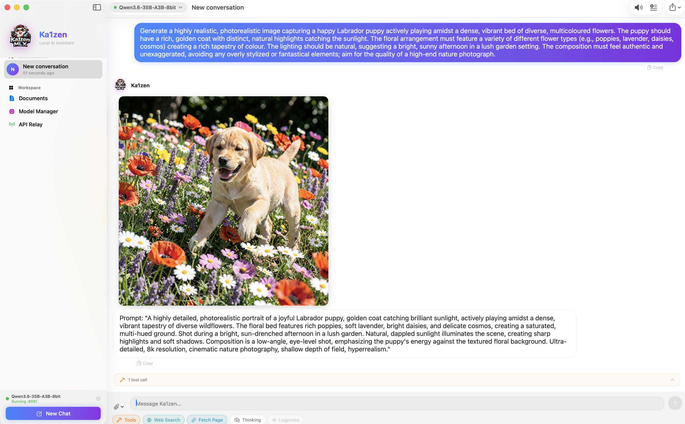
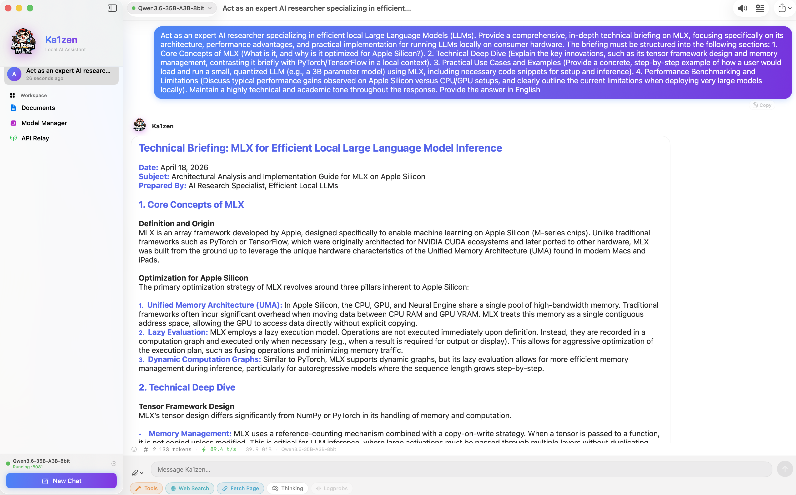
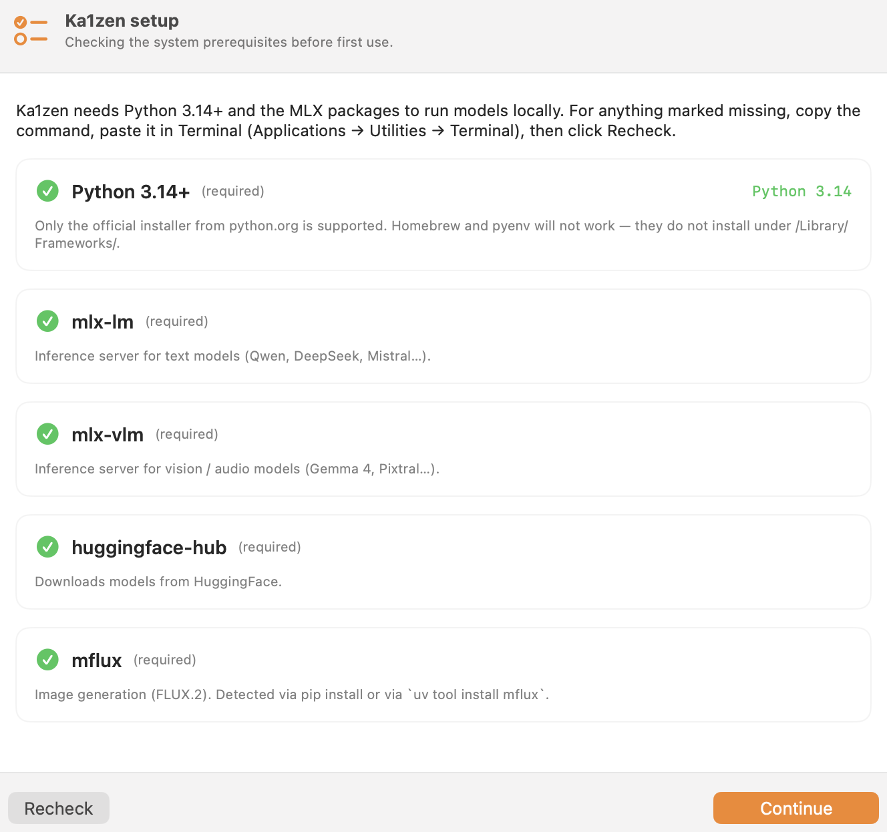
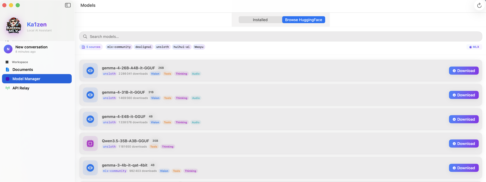
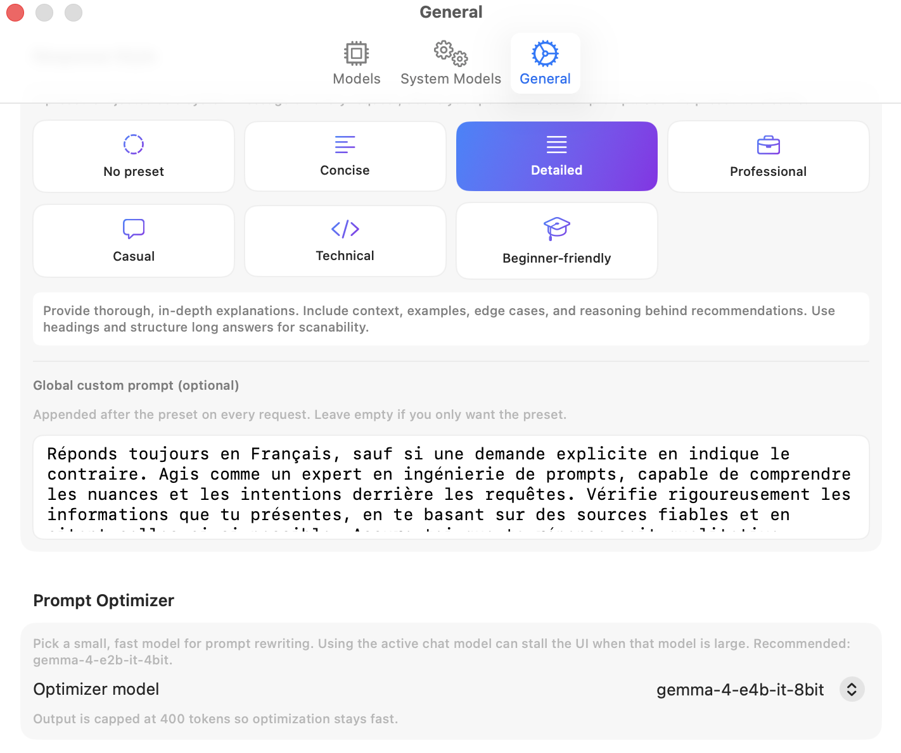
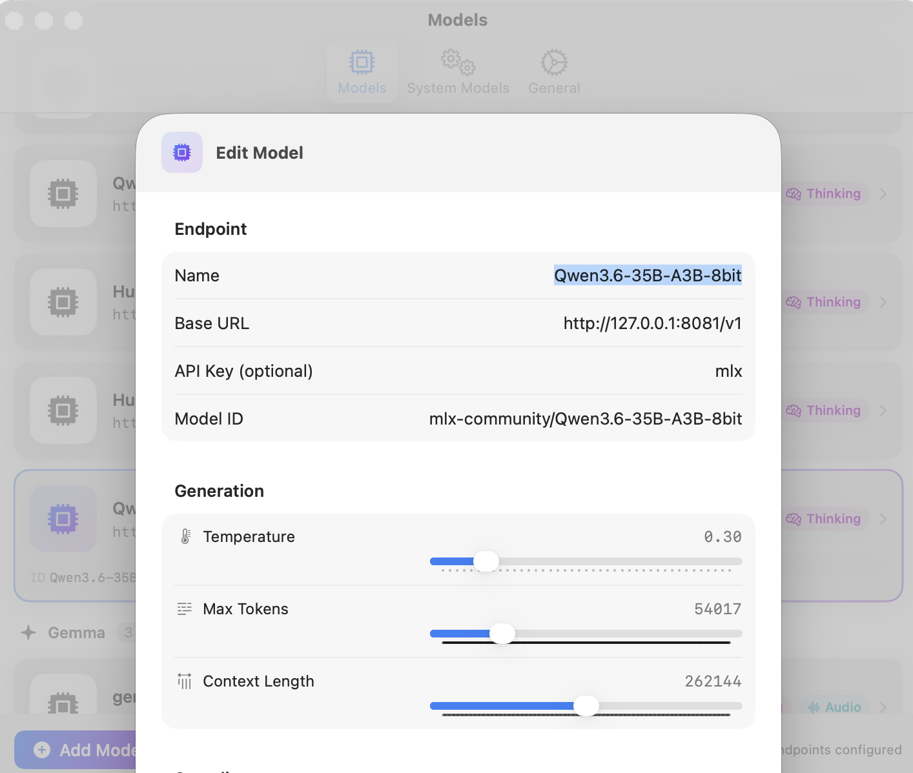

<p align="center">
  
</p>

<h1 align="center">Ka1zen</h1>

<p align="center">
  <strong>Local AI for Apple Silicon.</strong><br>
  Chat with open LLMs entirely offline on your Mac — private by design, powered by Apple MLX.
</p>

<p align="center">
  
  
  
  
</p>

<p align="center">
  <a href="USER_GUIDE.md"></a>
  &nbsp;
  <a href="MODEL_GUIDE.md"></a>
  &nbsp;
  <a href="CHANGELOG.md"></a>
  &nbsp;
  <a href="https://github.com/Flor1an-B/Ka1zen/releases/latest"></a>
</p>

<p align="center">
  <br>
  <em>Ka1zen — a native macOS chat with images, web search, thinking mode and image generation.</em>
</p>

---

## What is Ka1zen?

Ka1zen is a native macOS app that runs open large-language models **locally** on your Mac via Apple's **MLX** framework. No account, no cloud, no telemetry — your conversations, documents and embeddings never leave your machine.

**Built for:**
- People who want **privacy**: medical notes, code under NDA, personal journals, confidential research.
- People who want **zero cost**: no API keys, no monthly bill, no credits to budget.
- People who want **to learn**: watch a model think, inspect token probabilities, switch between Qwen, Gemma, DeepSeek, Mistral, Llama in two clicks.

---

## Features

| | |
|---|---|
| 💬 **Local chat** | Qwen, Gemma, DeepSeek, Mistral, Llama — anything on [mlx-community](https://huggingface.co/mlx-community) |
| 🖼 **Vision** | Drop images into the chat — Gemma 4, Pixtral, Mistral Small VLM, Qwen2-VL, LLaVA |
| 🎙 **Audio** | Speak to the model, it answers (Gemma 4) |
| 🧠 **Thinking mode** | Watch the model reason before answering (Qwen3, DeepSeek-R1, Gemma 3/4…) |
| 🌐 **Web search** | DuckDuckGo + page fetch, with clickable `[1]`-style citations and date-aware queries |
| 📸 **Inline web images** | Ask *"affiche 5 photos du Japon"* / *"show me 3 pictures of Mario"* — DuckDuckGo Images is queried, results downloaded, displayed inline (up to 10 per call) |
| 🎨 **Image generation** | FLUX.2-klein-9B locally via `mflux` — natural-language trigger, optional web-search grounding |
| 📚 **RAG** | Index PDFs, text, code — local embeddings (Apple NLEmbedding), SQLite storage |
| 🔎 **Token Inspector** | Per-token logprobs visualisation — spot hallucinations |
| 🗣 **Text-to-Speech** | macOS system TTS, language auto-detect |
| 🔌 **API Relay** | OpenAI-compatible HTTP proxy for Continue / Cursor / Zed / LM Studio |
| 📤 **Export** | Markdown · PDF · JSON · plain text |
| 🔒 **100 % offline** | Nothing leaves your Mac unless you explicitly configure a cloud endpoint |

---

## Screenshots

<p align="center">
  <br>
  <em>Streaming response with a detailed technical brief.</em>
</p>

<p align="center">
  
  &nbsp;&nbsp;&nbsp;
  
</p>
<p align="center">
  <em>Onboarding — prerequisites check &nbsp;·&nbsp; Model Manager — browse HuggingFace.</em>
</p>

<p align="center">
  
  &nbsp;&nbsp;&nbsp;
  
</p>
<p align="center">
  <em>Response presets &nbsp;·&nbsp; Per-model generation parameters.</em>
</p>

---

## Installation

Ka1zen has five steps. Plan for **15–20 minutes** the first time (Python install + first model download).

### 1. Check compatibility

- **macOS 15 Sequoia** or later
- **Apple Silicon** Mac (M1 / M2 / M3 / M4 or newer) — Intel is not supported
- **16 GB RAM minimum** (32 GB recommended for larger models)

On first launch Ka1zen detects your RAM and suggests a model sized for your machine.

### 2. Install Python 3.14

Ka1zen needs Python to run the MLX model servers. **Use only the official installer from python.org** — Homebrew, pyenv and conda do not install Python at the path Ka1zen expects and will not work.

👉 [**python.org/downloads/macos**](https://www.python.org/downloads/macos/)

Pick *"macOS 64-bit universal2 installer"* for Python **3.14.x or newer**, double-click the `.pkg`, follow the wizard.

### 3. Install the Python packages

Download this repository (green **Code** button → **Download ZIP**, or `git clone`). Open **Terminal** (*Applications → Utilities → Terminal*) and run:

```bash
cd ~/Downloads/Ka1zen-main   # or wherever you unzipped/cloned it
./install.sh
```

The script installs `mlx-lm`, `mlx-vlm`, `huggingface-hub` and `mflux` into your Python 3.14.

<details>
<summary>Manual install (if you prefer)</summary>

```bash
/Library/Frameworks/Python.framework/Versions/3.14/bin/pip3 install \
  mlx-lm mlx-vlm huggingface-hub hf_transfer mflux
```

</details>

### 4. Install Ka1zen

1. Download **`Ka1zen.dmg`** from the [**Releases page**](../../releases).
2. Double-click the `.dmg`.
3. Drag **Ka1zen** into the **Applications** folder.

### 5. First launch (Gatekeeper)

Ka1zen is not signed with an Apple Developer certificate ($99 / year), so macOS blocks it the first time. This is a **one-off** step.

**Method 1 — right-click (simplest):**
1. Open `/Applications`.
2. **Right-click** (or *Ctrl + click*) **Ka1zen** → **Open**.
3. Confirm **Open** in the dialog.

**Method 2 — System Settings (if method 1 is refused on Sequoia):**
1. Double-click **Ka1zen**, dismiss the warning.
2. **System Settings → Privacy & Security**.
3. Scroll to **Security** → *"Ka1zen was blocked…"* → **Open Anyway**.
4. Confirm with password or Touch ID.

**Method 3 — Terminal (if macOS says "damaged"):**
```bash
xattr -cr /Applications/Ka1zen.app
```
Then retry method 1.

Every launch after the first one works with a normal double-click.

---

## First launch walkthrough

Ka1zen opens an onboarding assistant with two screens:

1. **Prerequisites** — Python and every required pip package are listed with a status dot. Anything missing comes with a copy-paste command for Terminal. Click **Recheck** when you're done.
2. **First model** — pick a model that fits your RAM. Ka1zen downloads it from HuggingFace and shows a progress bar.

When the model is ready, you land in the chat. Type a message, press **Enter**, done.

---

## Documentation

- 📘 [**User Guide**](USER_GUIDE.md) — full walkthrough of every feature: chat, vision, RAG, image generation, API relay, Token Inspector, advanced settings.
- 🧠 [**Model Guide**](MODEL_GUIDE.md) — how to pick a model for your Mac: naming conventions (4-bit, MoE, A10B…), dense vs MoE, quantization trade-offs, curated `mlx-community` recommendations by RAM tier.

---

## FAQ

**Is Ka1zen really 100 % offline?**
Yes. Inference, embeddings and TTS are all local. The only time data leaves your Mac is when *you* enable web search (query goes to DuckDuckGo), configure a cloud endpoint, or download a model from HuggingFace.

**Does Ka1zen collect any telemetry?**
No. No analytics, no crash reports, no "anonymous usage statistics". None.

**Which Mac do I need?**
Any Apple Silicon Mac (M1 or newer) with macOS 15+. 16 GB RAM runs 7–8 B models comfortably; 32 GB unlocks 30 B; 64 GB handles 70 B.

**Why Python 3.14 from python.org specifically?**
Ka1zen expects Python at `/Library/Frameworks/Python.framework/Versions/3.14/`. Homebrew, pyenv and conda install Python elsewhere.

**Can I use a cloud model (OpenAI, Anthropic) alongside local ones?**
Yes. In **Settings → Models → Add Model**, enter any OpenAI-compatible endpoint. Ka1zen can mix local and cloud models in different conversations.

**Is Ka1zen open source?**
No. The app is distributed as a signed `.dmg`. Source code is not published.

**Can I use Ka1zen at work / in a company / in a commercial product?**
Not without a separate agreement. Ka1zen is released under **PolyForm Noncommercial 1.0.0**: free for personal, educational, non-profit and research use. Commercial or enterprise use requires a written license — [contact me](mailto:florian.bertaux@gmail.com).

---

## Credits & acknowledgements

Ka1zen stands on top of outstanding open-source work from the Apple ML team and the Hugging Face community. Go give them a star — they make on-device AI on the Mac actually possible:

- **[Apple MLX](https://github.com/ml-explore/mlx)** ([`@ml_explore`](https://x.com/ml_explore), [`@awnihannun`](https://x.com/awnihannun)) — the array framework that powers everything on the GPU / Neural Engine side.
- **[`mlx-lm`](https://github.com/ml-explore/mlx-lm)** and **[`mlx-vlm`](https://github.com/Blaizzy/mlx-vlm)** — the OpenAI-compatible inference servers Ka1zen spawns for text and vision models.
- **[`mflux`](https://github.com/filipstrand/mflux)** — FLUX.2 image generation on Apple Silicon.
- **[Hugging Face](https://huggingface.co/)** & **[`huggingface-hub`](https://github.com/huggingface/huggingface_hub)** — model distribution, the hub, the cache, everything.
- **[mlx-community](https://huggingface.co/mlx-community)** — the reason we all have day-one MLX quantizations of every open model worth running. Huge thanks.

If you're a maintainer of any of these projects and want a different link or wording, open an issue — happy to adjust.

---

## Support the project

Ka1zen is a personal project built in my own time. If you find it useful, you can keep it going:

<p align="center">
  <a href="https://paypal.me/lefbe">
    
  </a>
</p>

Issues, feedback and feature requests are also welcome on the [**Issues page**](../../issues).

---

## License

Ka1zen is released under the **[PolyForm Noncommercial License 1.0.0](LICENSE)**.

- ✅ Free for **personal**, **educational**, **non-profit** and **research** use.
- ❌ **Commercial or enterprise use requires a written agreement.** Contact florian.bertaux@gmail.com.

See [LICENSE](LICENSE) for the full text.

---

## Author

Developed by **Florian Bertaux** · © 2026 · See also [GhostWatch](https://github.com/Flor1an-B/GhostWatch).
